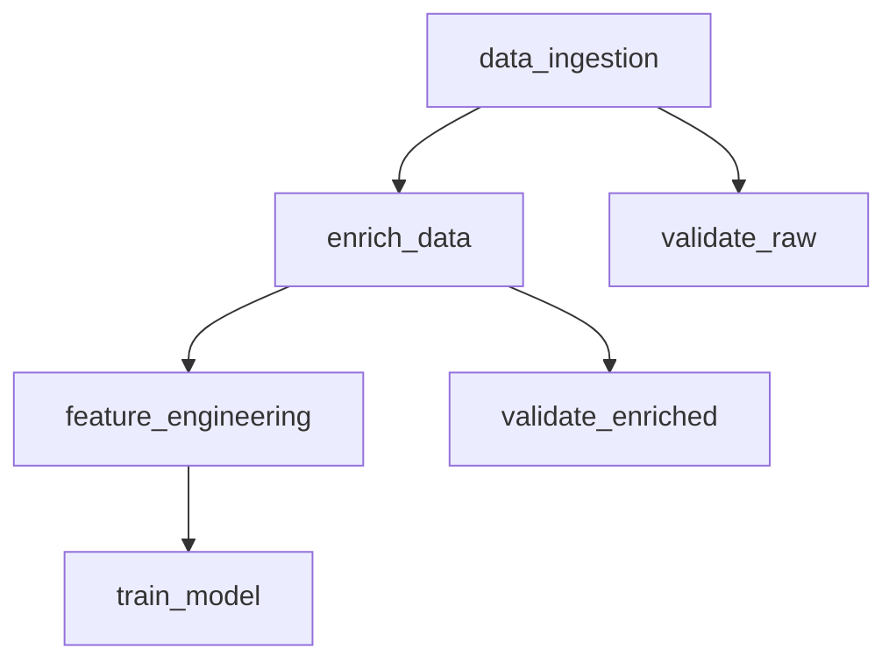

```mermaid
flowchart TD
	node1["data_ingestion"]
	node2["enrich_data"]
	node3["feature_engineering"]
	node4["train_model"]
	node5["validate_enriched"]
	node6["validate_raw"]
	node1-->node2
	node1-->node6
	node2-->node3
	node2-->node5
	node3-->node4
```