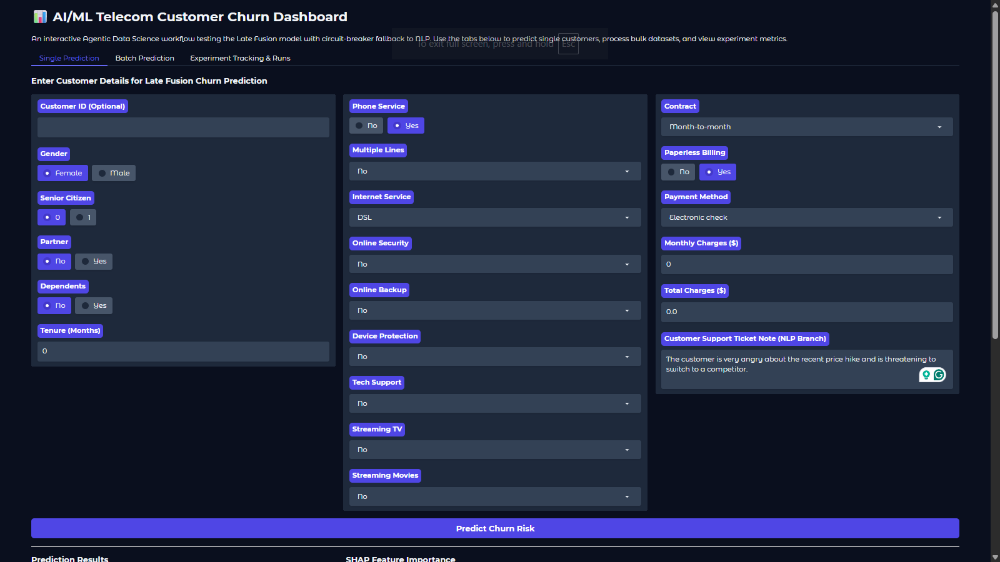
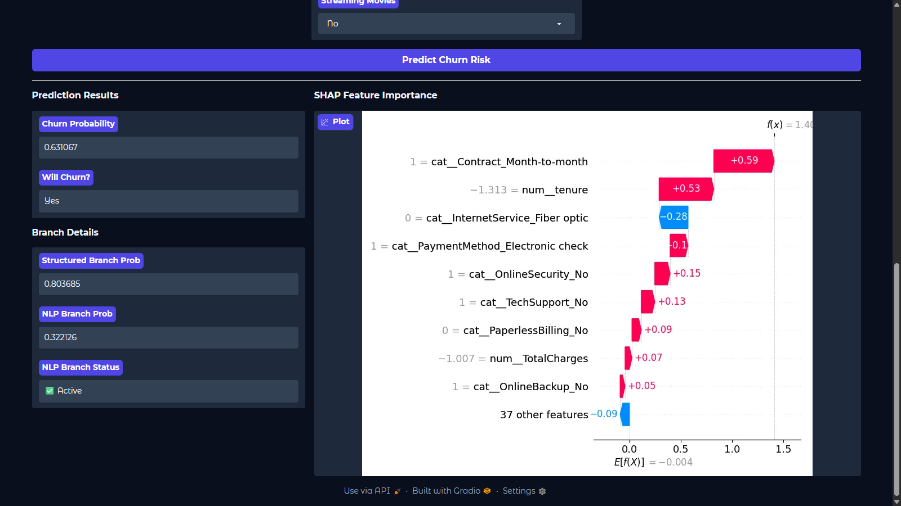

# 📡 AI/ML Telecom Customer Churn — Hybrid Agentic MLOps System

[](https://github.com/SebastianGarrido2790/ai-ml-telecom-customer-churn/actions/workflows/ci.yml)
[](https://github.com/SebastianGarrido2790/ai-ml-telecom-customer-churn/actions/workflows/cd.yml)
[](https://github.com/SebastianGarrido2790/ai-ml-telecom-customer-churn)
[](https://www.python.org/downloads/release/python-3110/)
[](LICENSE.txt)
[](https://docs.astral.sh/uv/)
[](https://docs.astral.sh/ruff/)

> **An end-to-end Hybrid Agentic MLOps system** that predicts telecom customer churn using a Late Fusion stacking ensemble (Structured XGBoost + NLP XGBoost → Logistic Regression), augmented by a `pydantic-ai` enrichment agent that synthesises realistic customer support ticket notes from structured records — demonstrating the FTI (Feature–Training–Inference) pattern, microservice architecture, and Responsible AI practices.

---

## 🖥️ Dashboard Preview

| Single Prediction + SHAP Explainability | Prediction Results & Branch Status |
|:---:|:---:|
|  |  |

> The Gradio dashboard provides single-customer prediction, batch CSV upload, and live Experiment Tracking & Runs views — all powered by the microservice backend.

---

## 🧠 What Makes This Project Different

- **Hybrid Agentic Architecture:** An LLM agent (Brain) generates synthetic NLP signals from structured records; deterministic ML models (Brawn) handle all quantitative prediction. No LLM does math.
- **Late Fusion Stacking:** Two independent XGBoost branches (structured features + NLP embeddings) are stacked via a Logistic Regression meta-learner trained on Out-of-Fold probabilities — beyond standard tutorial-level modeling.
- **Production-Grade MLOps:** DVC pipeline, MLflow experiment tracking, Great Expectations data contracts, SMOTE per branch, Optuna hyperparameter search, model registry, and circuit-breaker fallback.
- **Anti-Skew Mandate:** Custom sklearn transformers (`TextEmbedder`, `NumericCleaner`) are the single source of truth for both training and inference — training-serving skew is architecturally eliminated.
- **Leakage Prevention:** `primary_sentiment_tag` (near-deterministically correlated with `Churn`) is excluded from all training branches via `DIAGNOSTIC_COLS`.

---

## 🏗️ Project Design & Strategy

For a deep dive into the strategic and technical foundation of this project, refer to the following documentation:

| Document | Location | Description |
|:---|:---|:---|
| **Architecture Overview** | [`reports/docs/architecture/architecture.md`](reports/docs/architecture/architecture.md) | Full FTI pattern, Late Fusion schematic, microservice topology, and data flow diagram |
| **DVC Pipeline** | [`reports/docs/architecture/dvc_pipeline.md`](reports/docs/architecture/dvc_pipeline.md) | 12-stage DAG breakdown: deps, params, outs, and metrics per stage |
| **Data Enrichment Design** | [`reports/docs/architecture/data_enrichment.md`](reports/docs/architecture/data_enrichment.md) | Agentic enrichment pipeline: 3-tier fallback, resume logic, leakage prevention |
| **Feature Engineering** | [`reports/docs/architecture/feature_engineering.md`](reports/docs/architecture/feature_engineering.md) | Anti-Skew Mandate, split preprocessors, PCA, two-branch merge |
| **Model Training** | [`reports/docs/architecture/model_training.md`](reports/docs/architecture/model_training.md) | OOF stacking, SMOTE per branch, Optuna, 3-run MLflow structure |
| **Inference Architecture** | [`reports/docs/architecture/inference.md`](reports/docs/architecture/inference.md) | Circuit breaker pattern, zero-vector fallback, SHAP explainability |
| **Gradio UI** | [`reports/docs/architecture/gradio_ui.md`](reports/docs/architecture/gradio_ui.md) | Dashboard design, tab structure, API communication |
| **CI/CD & Cloud Deployment** | [`reports/docs/architecture/cicd_cloud_deployment.md`](reports/docs/architecture/cicd_cloud_deployment.md) | GitHub Actions CI/CD, LocalStack simulation, ECS Fargate architecture |
| **Sentiment Tag Correlation** | [`reports/docs/decisions/sentiment_tag_correlation.md`](reports/docs/decisions/sentiment_tag_correlation.md) | Decision A2: why `primary_sentiment_tag` was excluded from training |
| **Architectural Reassessment** | [`reports/docs/decisions/architectural_reassessment.md`](reports/docs/decisions/architectural_reassessment.md) | Decision log for Late Fusion vs. Early Fusion, SMOTE placement |
| **Training Diagnosis** | [`reports/docs/evaluations/traning_results_diagnosis.md`](reports/docs/evaluations/traning_results_diagnosis.md) | Post-training results analysis and recall vs. precision trade-off |
| **Codebase Review** | [`reports/docs/evaluations/codebase_review.md`](reports/docs/evaluations/codebase_review.md) | Production readiness assessment — score: **8.9 / 10** |
| **Executive Summary** | [`reports/docs/workflows/executive_summary.md`](reports/docs/workflows/executive_summary.md) | Phase-by-phase implementation summary (Phases 5–8) |

---

## 🔄 System Architecture

```
┌─────────────────────────────────────────────────────────────┐
│                    FEATURE PIPELINE (DVC)                   │
│                                                             │
│  Stage 0: Data Ingestion (raw Telco CSV)                   │
│      ↓                                                      │
│  Stage 1: Data Validation (Great Expectations — raw)       │
│      ↓                                                      │
│  Stage 2: Data Enrichment (pydantic-ai Agent)              │
│           Gemini → Ollama → Deterministic fallback         │
│      ↓                                                      │
│  Stage 3: Enriched Validation (Great Expectations)         │
│      ↓                                                      │
│  Stage 4: Feature Engineering                              │
│           Structured Preprocessor ──┐                      │
│           NLP Preprocessor (PCA20) ─┘ → Split artifacts   │
│                                                             │
├─────────────────────────────────────────────────────────────┤
│                    TRAINING PIPELINE                        │
│                                                             │
│  Stage 5: Late Fusion Model Training (MLflow)              │
│           ┌──────────────────────────────────────────┐     │
│           │  Branch 1: Structured XGBoost (Optuna)   │     │
│           │  Branch 2: NLP XGBoost (Optuna)          │     │
│           │  Meta-Learner: Logistic Regression (OOF) │     │
│           └──────────────────────────────────────────┘     │
│           → Model Registry (telco-churn-late-fusion)       │
│                                                             │
├─────────────────────────────────────────────────────────────┤
│                    INFERENCE PIPELINE                       │
│                                                             │
│  ┌─────────────────────┐    ┌────────────────────────────┐ │
│  │   Embedding Service │    │    Prediction API          │ │
│  │   FastAPI :8001     │◄───│    FastAPI :8000           │ │
│  │   SentenceTransform │    │    Late Fusion Inference   │ │
│  │   + PCA-20 pipeline │    │    SHAP Explainability     │ │
│  └─────────────────────┘    └────────────────────────────┘ │
│                                      ▲                      │
│                              ┌───────┴──────┐              │
│                              │  Gradio UI    │              │
│                              │  :7860        │              │
│                              └──────────────┘              │
└─────────────────────────────────────────────────────────────┘
```

---

## 🛠️ Technology Stack

| Layer | Technology | Purpose |
|:---|:---|:---|
| **Language** | Python 3.11 | Core language |
| **Dependency Management** | `uv` | Fast, deterministic resolution |
| **Linting / Formatting** | `ruff`, `pyright` | Python-Development Standard |
| **Pipeline Orchestration** | DVC | 12-stage reproducible DAG |
| **Experiment Tracking** | MLflow | Metrics, artifacts, model registry |
| **Data Validation** | Great Expectations | Schema and statistical contracts |
| **Agentic Enrichment** | `pydantic-ai` + Google Gemini | Synthetic NLP signal generation |
| **NLP Embeddings** | `sentence-transformers` (all-MiniLM-L6-v2) | Text → 384-dim vectors |
| **ML Models** | XGBoost + scikit-learn | Base learners + meta-learner |
| **Hyperparameter Search** | Optuna (TPE Sampler) | Recall-optimized tuning |
| **Explainability** | SHAP | Waterfall plots per prediction |
| **Imbalance Handling** | SMOTE (imbalanced-learn) | Per-branch oversampling |
| **API Serving** | FastAPI + Uvicorn | Prediction API + Embedding Service |
| **UI** | Gradio | Interactive dashboard |
| **Containerization** | Docker + Docker Compose | Multi-stage, non-root images |
| **CI/CD** | GitHub Actions | CI (lint+type+test) + CD (LocalStack) |
| **Pre-commit** | pre-commit | 14 hooks for local quality gates |

---

## 🚀 Quick Start

### Option A — Local (No Docker)

**Prerequisites:** Python 3.11, [`uv`](https://docs.astral.sh/uv/getting-started/installation/)

```bash
# 1. Clone and install
git clone https://github.com/SebastianGarrido2790/ai-ml-telecom-customer-churn.git
cd ai-ml-telecom-customer-churn

uv sync --all-extras

# 2. Configure environment
cp .env.example .env
# Edit .env with your GOOGLE_API_KEY and other secrets

# 3. Run the DVC pipeline (Feature + Training stages)
uv run dvc repro

# 4. Launch all services and the dashboard
launch_system.bat        # Windows
# OR manually:
uv run mlflow server --host 127.0.0.1 --port 5000 &
uv run uvicorn src.api.embedding_service.main:app --port 8001 &
uv run uvicorn src.api.prediction_service.main:app --port 8000 &
uv run python src/ui/app.py
```

Open `http://localhost:7860` in your browser.

### Option B — Docker Compose

```bash
# Build and start all services
docker compose up --build

# Services available at:
#   Gradio UI          → http://localhost:7860
#   Prediction API     → http://localhost:8000/docs
#   Embedding Service  → http://localhost:8001/docs
#   MLflow             → http://localhost:5000
```

### System Health Validation

```bash
validate_system.bat      # Windows (4-pillar health check)
bash validate_system.sh  # Linux/macOS
```

Validates: ✅ Dependencies → ✅ Static Quality (ruff + pyright) → ✅ Tests (65% coverage gate) → ✅ DVC sync → ✅ Service health

---

## 📋 Pipeline Stages

| # | Stage | Component | Input | Output |
|:---:|:---|:---|:---|:---|
| 0 | **Data Ingestion** | `DataIngestion` | Raw Telco CSV | `artifacts/data_ingestion/` |
| 1 | **Data Validation** | `DataValidator` (GX) | Ingested CSV | Validated CSV + status report |
| 2 | **Data Enrichment** | `EnrichmentOrchestrator` (pydantic-ai) | Validated CSV | Enriched CSV (+ ticket notes) |
| 3 | **Enriched Validation** | `DataValidator` (GX) | Enriched CSV | Validated enriched CSV |
| 4 | **Feature Engineering** | `FeatureEngineering` | Enriched CSV | train/val/test CSVs + 2 `.pkl` preprocessors |
| 5 | **Model Training** | `LateFusionTrainer` | Feature CSVs | 3 model `.pkl` files + evaluation report |
| — | **Embedding Service** | FastAPI `:8001` | `ticket_note` text | PCA-20 embedding vector |
| — | **Prediction API** | FastAPI `:8000` | Customer features | Churn probability + SHAP |
| — | **Gradio UI** | Gradio `:7860` | User input | Interactive predictions |

---

## 🌐 API Reference

### Prediction API (`http://localhost:8000`)

**Single Prediction**
```bash
curl -X POST http://localhost:8000/v1/predict \
  -H "Content-Type: application/json" \
  -d '{
    "gender": "Female", "SeniorCitizen": 0, "Partner": "Yes",
    "Dependents": "No", "tenure": 12, "PhoneService": "Yes",
    "MultipleLines": "No", "InternetService": "Fiber optic",
    "OnlineSecurity": "No", "OnlineBackup": "No",
    "DeviceProtection": "No", "TechSupport": "No",
    "StreamingTV": "Yes", "StreamingMovies": "Yes",
    "Contract": "Month-to-month", "PaperlessBilling": "Yes",
    "PaymentMethod": "Electronic check",
    "MonthlyCharges": 80.5, "TotalCharges": "966.0",
    "ticket_note": "Customer is angry about billing increase and considering cancellation."
  }'
```

**Response schema:** `churn_probability`, `will_churn`, `structured_branch_prob`, `nlp_branch_prob`, `nlp_branch_available`, `shap_values`

**Batch Prediction**
```bash
curl -X POST http://localhost:8000/v1/predict/batch \
  -H "Content-Type: application/json" \
  -d '{"customers": [<customer_1>, <customer_2>]}'
```

**Embedding Service (`http://localhost:8001`)**
```bash
curl -X POST http://localhost:8001/v1/embed \
  -H "Content-Type: application/json" \
  -d '{"ticket_note": "Issue with billing"}'
# Returns: {"embedding": [0.12, -0.03, ...], "dim": 20}
```

Full interactive docs at `/docs` on each service.

---

## 📊 Model Performance

The training pipeline logs three MLflow runs, measuring the **ROI of NLP enrichment**:

| Branch | Recall | F1-Score | AUC-ROC | Notes |
|:---|:---:|:---:|:---:|:---|
| **Structured Baseline** (XGBoost) | 0.7714 | 0.6457 | 0.8500 | 19 structured features only |
| **NLP Baseline** (XGBoost) | 0.7107 | 0.4932 | 0.6810 | 20 PCA-compressed ticket note embeddings |
| **Late Fusion Stacked** (meta-LR) | 0.6536 | 0.6224 | 0.8476 | OOF stacking of both branches |

> *Run `uv run dvc repro` then open MLflow at `http://localhost:5000` to view the current experiment results. The metrics above represent the reference performance of the current champion run.*

**Key business metric:** **Recall** (minimising false negatives = missed churners). Optuna tunes both XGBoost branches to maximise Recall.

---

## 📁 Project Structure

```
ai-ml-telecom-customer-churn/
├── .github/workflows/        # CI (lint + test) + CD (LocalStack ECS simulation)
├── .pre-commit-config.yaml   # 14-hook pre-commit pipeline
├── config/                   # config.yaml (paths) + params.yaml (hyperparams) + schema.yaml
├── data/raw/                 # Raw Telco CSV (DVC-tracked)
├── docker/                   # Per-service Dockerfiles + shared entrypoint.sh
├── dvc.yaml                  # 12-stage DVC DAG
├── launch_system.bat         # One-click: MLflow + Embedding + Prediction + Gradio
├── Makefile                  # Developer workflow targets
├── notebooks/                # Exploratory analysis notebooks
├── pyproject.toml            # Project metadata, deps, ruff, pyright config
├── reports/
│   ├── docs/                 # Architecture, decisions, evaluations, workflows
│   └── figures/              # Dashboard screenshots
├── src/
│   ├── api/
│   │   ├── embedding_service/  # FastAPI :8001 — NLP embedding microservice
│   │   └── prediction_service/ # FastAPI :8000 — Late Fusion inference API
│   ├── components/
│   │   ├── data_enrichment/    # pydantic-ai enrichment agent
│   │   ├── model_training/     # LateFusionTrainer + Evaluator
│   │   ├── data_ingestion.py
│   │   ├── data_validation.py
│   │   └── feature_engineering.py
│   ├── config/               # ConfigurationManager (Singleton)
│   ├── constants/            # Project-wide paths (single source of truth)
│   ├── entity/               # Frozen dataclass config entities
│   ├── pipeline/             # Stage orchestrators (stage_00 → stage_05)
│   ├── ui/                   # Gradio dashboard (app.py)
│   └── utils/                # logger, exceptions, feature_utils, config_manager
├── tests/
│   └── unit/                 # 17 test files covering all components and APIs
├── task-definitions/         # ECS task definition JSON files
├── validate_system.bat       # 4-pillar health check
└── docker-compose.yaml       # Full stack orchestration
```

---

## 🔒 Security & Quality Gates

| Gate | Tool | Threshold |
|:---|:---|:---|
| **Linting** | `ruff check` | Zero errors |
| **Formatting** | `ruff format` | Consistent style |
| **Type Safety** | `pyright` (standard mode) | Zero type errors |
| **Test Coverage** | `pytest-cov` | ≥ 65% |
| **Pre-commit** | 14 hooks | Blocks bad commits |
| **Credential Safety** | `.env` blocked by pre-commit | Secrets never committed |
| **DVC Safety** | `.pkl`/`.csv` blocked in Git | Artifacts versioned via DVC |
| **Dependency Lock** | `uv.lock` | Reproducible environments |

---

## ⚙️ Development Workflow

```bash
# Install all dependencies (including dev extras)
uv sync --all-extras

# Install pre-commit hooks (one-time per machine)
uv run pre-commit install

# Run linting + formatting
uv run ruff check src/ tests/
uv run ruff format src/ tests/

# Type checking
uv run pyright

# Run tests with coverage
uv run pytest tests/ --cov=src --cov-report=term-missing

# Full health check (all 4 pillars)
validate_system.bat

# Reproduce the full DVC pipeline
uv run dvc repro

# View MLflow experiments
uv run mlflow ui --port 5000
```

See the [Makefile](Makefile) for all available targets.

---

## 📄 License

[MIT License](LICENSE.txt) — © 2026 Sebastian Garrido
