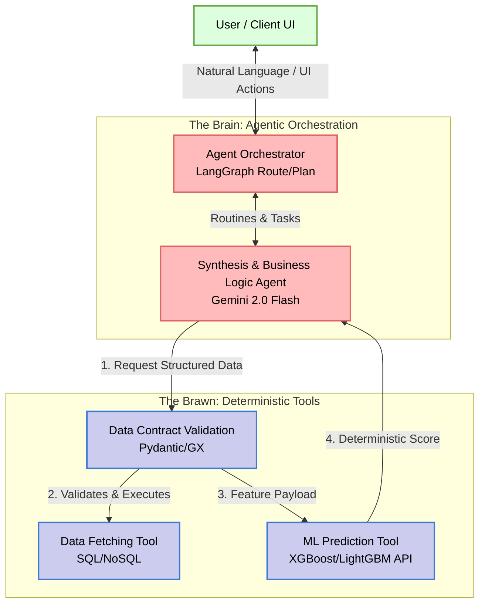
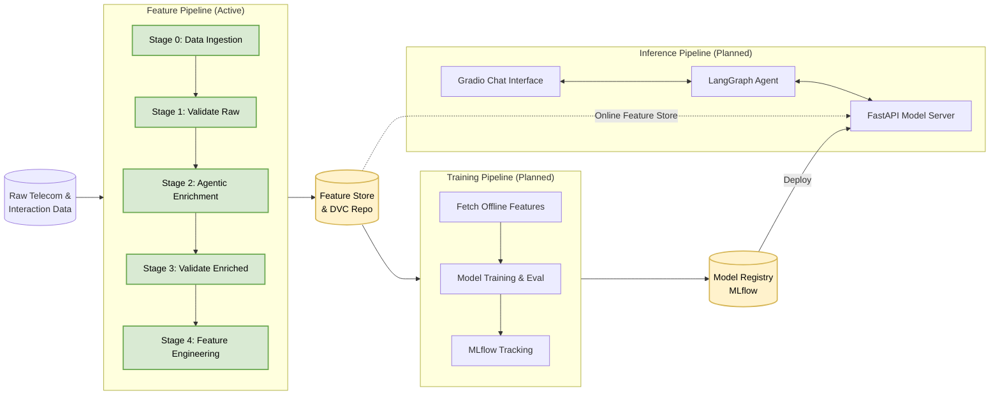

# Telecom Customer Churn Prediction: Agentic MLOps Architecture Report

## 1. Executive Summary

This document presents the comprehensive architecture for the **Telecom Customer Churn Prediction**
platform. This project represents a shift from traditional MLOps (Model-Centric) to an
**Agentic MLOps** paradigm. It orchestrates intelligent systems by combining deterministic
traditional machine learning models (XGBoost/LightGBM) with probabilistic AI Agents
(Google Gemini 2.0 Flash + pydantic-ai) to analyze both quantitative telecom usage metrics
and qualitative customer interactions (synthetic ticket notes and sentiment analysis).

The system strictly adheres to the **FTI (Feature, Training, Inference)** pattern and an
"Agentic Architecture" standard, ensuring a deep decoupling between data logic, model
training, and the intelligent agents serving predictions and business insights.

---

## 2. High-Level Agentic Architecture

At the core of this system is the **Brain vs. Brawn** separation of concerns:
- **The Brain (Agents):** Handled by pydantic-ai and Gemini 2.0 Flash. They reason, route, interpret business context, and synthesize predictions into actionable strategies. They operate purely on probabilities.
- **The Brawn (Tools):** High-performance microservices (FastAPI), strict data validation (Great Expectations, Pydantic), and deterministic ML models. They are robust, typed, and purely objective.

### 2.1 Brain vs. Brawn Diagram



---

## 3. The FTI Pattern (Feature, Training, Inference)

The traditional ML lifecycle is divided into three completely independent pipelines ensuring
high scalability, no training-serving skew, and parallelized development.

### 3.1 Feature Pipeline (Data Engineering) — ACTIVE

Responsible for ingesting, validating, and transforming raw telecom data into high-quality
predictive signals.
- **Data Contracts:** Uses Great Expectations v1.0+ to ensure schema drift does not corrupt the data.
- **Agentic Enrichment:** A pydantic-ai Agent synthesizes qualitative ticket notes from quantitative features.
- **Versioning:** Handled by DVC, generating reproducible data artifacts.
- **Output:** Curated, enriched, validated ML features + **Validation Artifacts** (`status.txt`, `validation_report.json`) at `artifacts/`.
- **Feature Engineering (Phase 4 — DONE):** Implements a unified `ColumnTransformer` (Numeric, Categorical, NLP) used for fitting on training data and transforming all datasets (train/val/test) to prevent training-serving skew. Results in a serialized `preprocessor.pkl`.

### 3.2 Training Pipeline (Model Development) — PLANNED

Consumes offline versioned data from the Feature Store to train robust ML artifacts.
- **Algorithms:** LightGBM, XGBoost, Scikit-learn.
- **Tracking:** Entire training runs, hyperparameters, metrics (Recall, F1, ROC-AUC), and lineage tracked in MLflow. We prioritize **Recall** to minimize the business cost of False Negatives.
- **Output:** Serialized model artifacts passed to the Model Registry.

### 3.3 Inference Pipeline (Model Serving) — PLANNED

Deploys the trained models and integrates them with the Agent ecosystem for the final corporate end-user.
- **Deployment:** A FastAPI microservice serving real-time predictions.
- **Agent Integration:** The API acts as a "Tool" for the LangGraph agent.
- **UI:** A Gradio/Streamlit application offering an Agentic Chat Interface.

### 3.4 FTI Pipeline Diagram



---

## 4. Agent Execution Patterns & Phase 2 Enrichment

To avoid "spaghetti prompt" logic, the system utilizes modular design patterns for LLM communication:

1.  **Agentic Data Enrichment (Phase 2 — DONE):** Uses `pydantic-ai` to orchestrate Gemini 2.0 Flash in the Feature Pipeline. It synthesizes "Soft Signals" (Ticket Notes) based on "Hard Signals" (Usage Statistics), effectively bridging the qualitative gap in the raw Telco dataset.
2.  **Fallback & Resiliency:** Implements deterministic fallback logic to ensure pipeline continuity if LLM APIs error out, maintaining MLOps readiness even in connectivity-gapped environments.
3.  **Router Pattern (Planned):** A classifier determines whether the user wants to predict churn for a specific user, generate a batch report, or simply ask a query about features.
4.  **Structured Outputs:** Agents are restricted to Pydantic `BaseModels` to communicate seamlessly with tools, eliminating hallucinated tool parameters.

> See [data_enrichment.md](data_enrichment.md) for a detailed architecture breakdown of Phase 2.
5.  **NLP Engineering (Phase 4 — DONE):** Integrates `SentenceTransformers` and `PCA` into the `ColumnTransformer`. This converts qualitative ticket notes into optimized numeric signals, effectively merging probabilistic AI outputs into deterministic ML features.

> See [feature_engineering.md](feature_engineering.md) for a detailed architecture breakdown of Phase 4.

---

## 5. Technology Stack Breakdown

*   **Language:** Python 3.12+ (Strict type hinting using `pyright`)
*   **Environment/Packaging:** `uv` (Fastest dependency resolution)
*   **Agent Orchestration:** `pydantic-ai` (Phase 2 Enrichment), `langgraph` (Planned for Agentic UI)
*   **LLM Model:** Gemini 2.0 Flash (via Google AI SDK)
*   **Modeling:** `xgboost`, `lightgbm`, `scikit-learn`
*   **MLOps/Tracking:** `mlflow`, `dvc`
*   **Validation:** `great-expectations` (v1.0+ API), `pydantic` (v2.x)
*   **Serving (The Brawn):** `fastapi`, `uvicorn`
*   **UX/UI:** `gradio`
*   **Linting/Formatting:** `ruff`

---

## 6. Project Directory Scheme

The codebase strictly shadows the FTI decoupling and Agentic separation.

```text
├── artifacts/              # Pipeline outputs (data, models, binary reports)
│   ├── data_ingestion/     # Fetched and unzipped raw data
│   ├── data_validation/    # Raw validation status & JSON reports
│   ├── data_enrichment/    # Enriched CSV + validation status & JSON reports
│   └── feature_engineering/ # Train/Val/Test CSVs + preprocessor.pkl
├── config/                 # System configuration (YAML)
│   ├── config.yaml         # Artifact paths & directories
│   ├── params.yaml         # Tunable hyperparameters (LLM model, limits)
│   └── schema.yaml         # Data contracts (column names & types)
├── data/                   # Raw and external datasets managed by DVC
├── reports/docs/           # Product and technical documentation
├── src/
│   ├── api/                # FastAPI microservice for Inference Serving (Planned)
│   ├── components/         # Business Logic / Workers (The "How")
│   │   ├── data_ingestion.py         # URL/File data sync
│   │   ├── data_validation.py        # GX Expectation Suites & validation runner
│   │   └── data_enrichment/          # Agentic LLM enrichment logic
│   │       ├── schemas.py            # Pydantic I/O contracts for the Agent
│   │       ├── prompts.py            # Versioned system prompt
│   │       ├── generator.py          # LLM tool (pydantic-ai Agent)
│   │       └── orchestrator.py       # Async batch processor
│   ├── config/             # ConfigurationManager (single config entry point)
│   ├── entity/             # Pydantic data contracts & config entities
│   ├── pipeline/           # Execution Stages / Conductors (The "When")
│   │   ├── stage_00_data_ingestion.py
│   │   ├── stage_01_data_validation.py
│   │   ├── stage_02_data_enrichment.py
│   │   ├── stage_03_enriched_validation.py
│   │   └── stage_04_feature_engineering.py
│   └── utils/              # Logger, feature_utils (Transformers), custom exceptions
├── tests/                  # Unit tests for tools and schemas
├── dvc.yaml                # DVC orchestration DAG
└── pyproject.toml          # Project metadata, dependencies, ruff/pyright config
```

---

## 7. Quality Assurance & Observability

- **Unit Testing:** Standard `pytest` testing for deterministic tools and schemas.
  See [test_suite.md](../runbooks/test_suite.md) for full coverage details.
- **Data Validation:** Great Expectations v1.0+ suites applied at ingestion and post-enrichment.
  See [data_validation_gx.md](data_validation_gx.md) for architecture details.
- **DVC Pipeline:** Reproducible, version-tracked DAG of all feature pipeline stages.
  See [dvc_pipeline.md](dvc_pipeline.md) for the full DAG and stage specifications.
- **Fail-Loud Exception Handling:** Custom Python exceptions (`StatisticalContractViolation`)
  encapsulate tool failures, providing agents with actionable error messages for self-correction.
- **Observability (Tracing — Planned):** OpenTelemetry spans for Chain of Thought, tool
  latency, and token usage in the Inference Phase.
- **Human-in-the-Loop (HITL — Planned):** Key decision junctions requiring business action
  require HITL authorization surfaced through the Gradio dashboard.
