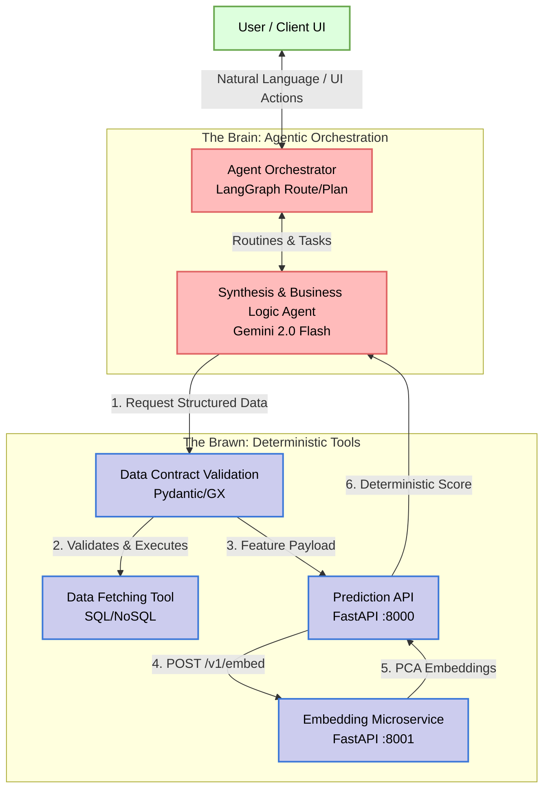
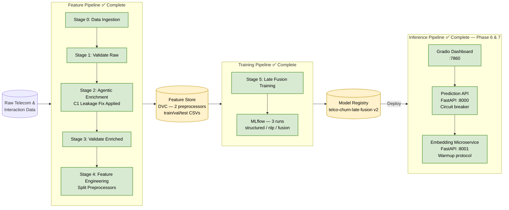

# Telecom Customer Churn Prediction: Agentic MLOps Architecture Report

## 1. Executive Summary

This document presents the comprehensive architecture for the **Telecom Customer Churn
Prediction** platform. This project represents a shift from traditional MLOps
(Model-Centric) to an **Agentic MLOps** paradigm. It orchestrates intelligent systems
by combining deterministic traditional machine learning models (XGBoost + Logistic
Regression stacker) with probabilistic AI Agents (Google Gemini 2.0 Flash + pydantic-ai)
to analyze both quantitative telecom usage metrics and qualitative customer interactions
(synthetic ticket notes and sentiment analysis).

The system adheres to the **FTI (Feature, Training, Inference)** pattern and the
"Agentic Architecture" standard, ensuring deep decoupling between data logic, model
training, and the intelligent agents serving predictions and business insights.

---

## 2. High-Level Agentic Architecture

The **Brain vs. Brawn** separation of concerns governs all system design decisions:

- **The Brain (Agents):** pydantic-ai + Gemini 2.0 Flash. They reason, route, interpret
  business context, and synthesize predictions into actionable strategies. They operate
  on probabilities.
- **The Brawn (Tools):** Two FastAPI microservices (Embedding Service + Prediction API),
  Great Expectations, Pydantic, and deterministic ML models. They are typed, deterministic,
  and purely objective.

### 2.1 Brain vs. Brawn Diagram



---

## 3. The FTI Pattern (Feature, Training, Inference)

### 3.1 Feature Pipeline — COMPLETE ✅

Responsible for ingesting, validating, and transforming raw telecom data into
high-quality predictive signals. Produces **two independently serialized preprocessors**
to support the Late Fusion training architecture and the Embedding Microservice.

- **Data Contracts:** Great Expectations v1.0+ at two validation checkpoints.
- **Agentic Enrichment:** pydantic-ai Agent generates leakage-free ticket notes from
  17 observable CRM fields (C1 fix applied — `Churn` field permanently excluded).
- **Split Preprocessors:** `structured_preprocessor.pkl` (numeric + categorical) and
  `nlp_preprocessor.pkl` (TextEmbedder + PCA) — each fitted on Train only.
- **Versioning:** DVC tracks all artifacts and configuration dependencies.

### 3.2 Training Pipeline — COMPLETE ✅

Implements the **Late Fusion stacking architecture** with three MLflow-tracked experiment
runs: structured baseline (Branch 1), NLP baseline (Branch 2), and the stacked meta-learner.

- **Leakage-Free Stacking:** OOF cross-validation prevents meta-learner leakage.
- **Independent SMOTE:** Applied per branch in each branch's own geometric space.
- **Optuna Tuning:** 30 trials (Branch 1), 20 trials (Branch 2), Recall-optimized.
- **Model Registry:** `telco-churn-late-fusion v2` registered in MLflow.

### 3.3 Inference Pipeline — COMPLETE ✅ (Phase 6)

Deployed as **two decoupled FastAPI microservices**, enforcing Rule 1.3 (Tools as
Microservices). Both services are operational and verified against real predictions.

**Embedding Microservice (port 8001):**
- Loads `nlp_preprocessor.pkl` at startup via `lifespan`.
- Runs SentenceTransformer warmup on startup — eliminates cold-start latency on
  the first real request and keeps the inter-service `httpx` timeout at 5s.
- Exposes `POST /v1/embed` and `GET /v1/health`.

**Prediction API (port 8000):**
- Loads all four artifacts at startup: `structured_preprocessor.pkl`,
  `structured_model.pkl`, `nlp_model.pkl`, `meta_model.pkl`.
- `InferenceService` owns all computation: DataFrame reconstruction → structured
  preprocessing → embedding call (with circuit breaker) → base model scoring →
  meta-learner stacking.
- Exposes `POST /v1/predict`, `POST /v1/predict/batch`, `GET /v1/health`.
- **Circuit breaker:** If embedding service is unreachable, falls back to zero-vector
  `(n, 20)`, sets `nlp_branch_available=False`, and continues structured prediction.

**Phase 6 operational proof:**

```
GET /v1/health (8000) → {"status":"healthy","model_version":"late-fusion-v2"}
GET /v1/health (8001) → {"status":"healthy","model_version":"all-MiniLM-L6-v2-pca20"}

POST /v1/predict (high-risk profile: Fiber optic, month-to-month, tenure=1):
→ churn_probability: 0.700559
→ p_structured: 0.889536  |  p_nlp: 0.407729
→ nlp_branch_available: true
```

**Gradio UI** (port 7860): COMPLETE ✅ (Phase 7). Interactive dashboard with SHAP and MLflow integration.

### 3.4 FTI Pipeline Diagram



---

## 4. Phase 2: Agentic Data Enrichment

1. **Agentic Data Enrichment (Phase 2 — Complete):** pydantic-ai orchestrates Gemini
   2.0 Flash in the Feature Pipeline. Synthesizes "Soft Signals" (Ticket Notes) from
   "Hard Signals" (Usage Statistics) using 17 observable CRM fields.

2. **C1 Leakage Fix (Phase 5 — Applied):** The original enrichment schema included the
   `Churn` target variable, causing the LLM to embed label information directly into
   ticket notes. After detection during Phase 5 model evaluation (NLP branch Recall=1.000),
   the schema was redesigned, the system prompt was rewritten with a CRM-agent persona,
   and the deterministic fallback was rewritten using feature-signal logic only.

3. **Fallback & Resiliency:** 3-tier fallback chain (Gemini → Ollama → deterministic
   feature-based rules). No target-variable reference at any tier.

4. **Structured Outputs:** All agent outputs are validated against `SyntheticNoteOutput`
   before being written to disk.

> See [data_enrichment.md](data_enrichment.md) for full architecture and leakage investigation.

5. **NLP Engineering (Phase 4 — Complete):** `TextEmbedder` (all-MiniLM-L6-v2) + PCA
   (20 components) isolated in `nlp_preprocessor.pkl`. The structured features are
   independently handled by `structured_preprocessor.pkl`. `primary_sentiment_tag` is
   excluded from both preprocessors (Decision A2).

> See [feature_engineering.md](feature_engineering.md) for architecture details.

6. **Late Fusion Training (Phase 5 — Complete):** Two XGBoost base models trained on
   separate feature branches with OOF stacking into a Logistic Regression meta-learner.

> See [model_training.md](model_training.md) for full architecture and experimental results.

7. **Inference Microservices (Phase 6 — Complete):** Two decoupled FastAPI services
   serve the Late Fusion pipeline in production. The Embedding Microservice owns the
   NLP branch; the Prediction API orchestrates the full inference flow with a circuit
   breaker fallback.

> See [inference_architecture.md](inference_architecture.md) for full architecture, circuit
> breaker design, warmup protocol, and operational verification.

8. **UI Development & Containerization (Phase 7 — Complete):** A dynamic Gradio Dashboard 
   providing an interactive churn risk calculator, SHAP feature importance visualizations, 
   and deep integration with MLflow. The entire 5-container infrastructure is orchestrated 
   via Docker Compose.

> See [gradio_ui.md](gradio_ui.md) for dashboard architecture and containerization details.

---

## 5. Technology Stack

| Layer | Technology |
|---|---|
| Language | Python 3.11+ (strict type hints via `pyright`) |
| Dependency Management | `uv` |
| Agent Orchestration | `pydantic-ai` (Phase 2), `langgraph` (Phase 7 planned) |
| LLM | Gemini 2.0 Flash (Google AI SDK) |
| ML Models | `xgboost`, `scikit-learn` (Logistic Regression meta-learner) |
| Imbalance Handling | `imbalanced-learn` (SMOTE, per-branch) |
| Hyperparameter Tuning | `optuna` |
| MLOps / Tracking | `mlflow`, `dvc` |
| Data Validation | `great-expectations` v1.0+, `pydantic` v2.x |
| Serving | `fastapi`, `uvicorn` (2 microservices — operational) |
| Inter-service HTTP | `httpx` (async, with circuit breaker) |
| UI | `gradio` (Phase 7 — Complete) |
| Linting / Formatting | `ruff` |
| Observability | `logfire` (Phase 2 tracing), OpenTelemetry (Phase 9 planned) |

---

## 6. Project Directory Scheme

```text
├── artifacts/
│   ├── data_ingestion/           # Fetched raw data
│   ├── data_validation/          # Raw GX status + JSON reports
│   ├── data_enrichment/          # Leakage-free enriched CSV + GX reports
│   ├── feature_engineering/      # Train/Val/Test CSVs
│   │                               structured_preprocessor.pkl
│   │                               nlp_preprocessor.pkl
│   └── model_training/           # structured_model.pkl, nlp_model.pkl,
│                                   meta_model.pkl, evaluation_report.json,
│                                   confusion matrices, feature importance charts
├── config/
│   ├── config.yaml               # Artifact paths + api service config
│   ├── params.yaml               # Tunable hyperparameters
│   └── schema.yaml               # Data contracts (column names & types)
├── data/                         # Raw datasets managed by DVC
├── docker/                       # Dockerfiles
│   ├── embedding-service/        # Dockerfile for the embedding microservice
│   ├── gradio-ui/                # Dockerfile for the Gradio dashboard
│   ├── mlflow-server/            # Dockerfile for the MLflow server
│   └── prediction-api/           # Dockerfile for the prediction microservice
├── reports/docs/                 # Product and technical documentation
├── src/
│   ├── api/
│   │   ├── embedding_service/    # main.py, router.py, schemas.py  (port 8001)
│   │   └── prediction_service/   # main.py, router.py, schemas.py,
│   │                               inference.py                    (port 8000)
│   ├── components/
│   │   ├── data_ingestion.py
│   │   ├── data_validation.py
│   │   ├── data_enrichment/      # schemas.py, prompts.py, generator.py, orchestrator.py
│   │   ├── feature_engineering.py
│   │   └── model_training/       # trainer.py, evaluator.py
│   ├── config/configuration.py   # ConfigurationManager — single YAML entry point
│   ├── entity/config_entity.py   # Frozen dataclass configs + Pydantic row contracts
│   ├── pipeline/                 # Conductor stages (stage_00 through stage_05)
│   ├── ui/                       # Gradio dashboard (Phase 7)
│   │   ├── app.py                # Main Gradio application
│   │   ├── components/           # Reusable UI components
│   │   ├── data_loaders/         # Data loading and preprocessing
│   │   └── pages/                # Dashboard pages
│   └── utils/                    # logger, feature_utils, exceptions, common
├── tests/unit/                   # 53 passing unit tests across 6 test files
├── .dockerignore                 # Docker ignore file
├── docker-compose.yml            # Orchestrates the 5-container infrastructure
├── dvc.yaml                      # 6-stage pipeline DAG
└── pyproject.toml
```

---

## 7. Quality Assurance & Observability

- **Unit Testing:** 53 passing tests across 6 test files. Phase 6 adds 24 new tests
  covering embedding schemas, prediction schemas, circuit breaker correctness, and
  DataFrame reconstruction. See [test_suite.md](../runbooks/test_suite.md).
- **Data Validation:** GX v1.0+ suites at two checkpoints. C1 fix required adding
  `"Dissatisfied"` to the enriched sentiment tag expectation.
  See [data_validation_gx.md](data_validation_gx.md).
- **Leakage Detection & Remediation:** Detected empirically during Phase 5 (NLP
  Recall=1.000), traced to `Churn` in `CustomerInputContext`, remediated via C1 fix.
  Permanently enforced by `test_customer_input_context_churn_field_absent`.
- **DVC Pipeline:** 6-stage reproducible DAG. See [dvc_pipeline.md](dvc_pipeline.md).
- **MLflow Tracking:** 3 experiment runs per training cycle with lift metrics.
- **Operational Verification:** Both microservices health-checked and real prediction
  verified (`churn_probability: 0.7006`, `nlp_branch_available: true`).
- **Observability (Planned — Phase 9):** OpenTelemetry spans for Chain of Thought,
  tool latency, and token usage.
- **HITL (Phase 7 — Complete):** Key risk decisions surfaced through the Gradio dashboard, offering branch-level probability breakdowns and SHAP visual explanations.