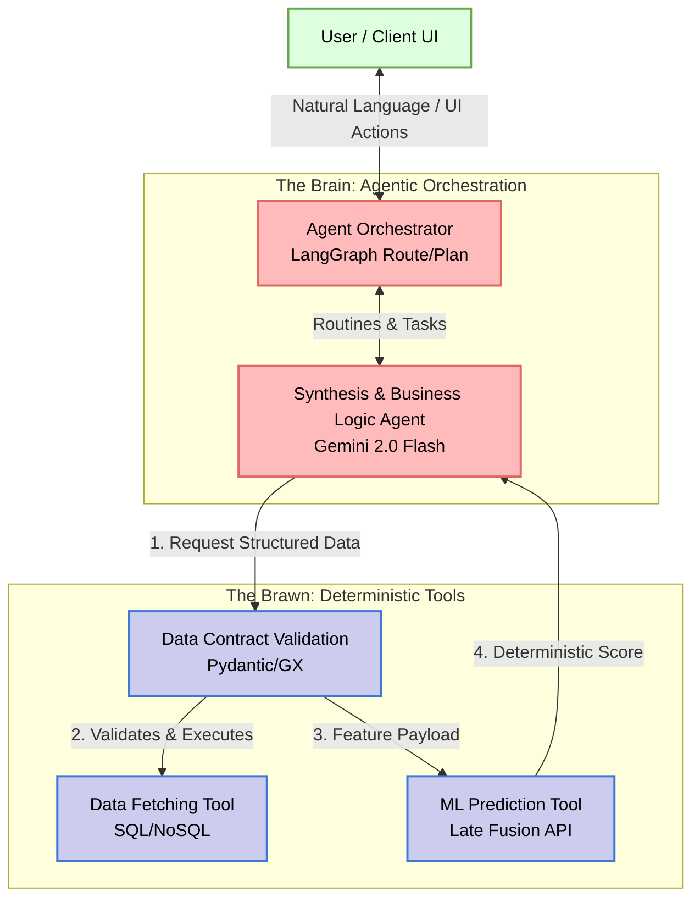
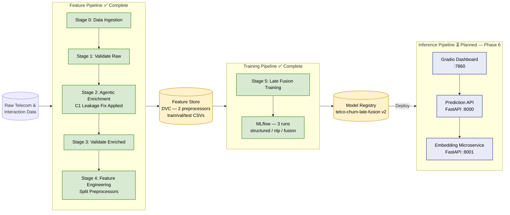

# Telecom Customer Churn Prediction: Agentic MLOps Architecture Report

## 1. Executive Summary

This document presents the comprehensive architecture for the **Telecom Customer Churn
Prediction** platform. This project represents a shift from traditional MLOps
(Model-Centric) to an **Agentic MLOps** paradigm. It orchestrates intelligent systems by combining deterministic traditional machine learning models (XGBoost + Logistic Regression stacker) with probabilistic AI Agents (Google Gemini 2.0 Flash + pydantic-ai) to analyze both quantitative telecom usage metrics and qualitative customer interactions (synthetic ticket notes and sentiment analysis).

The system adheres to the **FTI (Feature, Training, Inference)** pattern and the "Agentic Architecture" standard, ensuring deep decoupling between data logic, model training, and the intelligent agents serving predictions and business insights.

---

## 2. High-Level Agentic Architecture

The **Brain vs. Brawn** separation of concerns governs all system design decisions:

- **The Brain (Agents):** pydantic-ai + Gemini 2.0 Flash. They reason, route, interpret business context, and synthesize predictions into actionable strategies. They operate on probabilities.
- **The Brawn (Tools):** FastAPI microservices (planned), Great Expectations, Pydantic, and deterministic ML models. They are typed, deterministic, and purely objective.

### 2.1 Brain vs. Brawn Diagram



---

## 3. The FTI Pattern (Feature, Training, Inference)

### 3.1 Feature Pipeline — COMPLETE ✅

Responsible for ingesting, validating, and transforming raw telecom data into high-quality predictive signals. Now produces **two independently serialized preprocessors** to support the Late Fusion training architecture and the planned Embedding Microservice.

- **Data Contracts:** Great Expectations v1.0+ at two validation checkpoints.
- **Agentic Enrichment:** pydantic-ai Agent generates leakage-free ticket notes from 17 observable CRM fields (C1 fix applied — `Churn` field permanently excluded).
- **Split Preprocessors:** `structured_preprocessor.pkl` (numeric + categorical) and `nlp_preprocessor.pkl` (TextEmbedder + PCA) — each fitted on Train only.
- **Versioning:** DVC tracks all artifacts and configuration dependencies.

### 3.2 Training Pipeline — COMPLETE ✅

Implements the **Late Fusion stacking architecture** with three MLflow-tracked experiment runs: structured baseline (Branch 1), NLP baseline (Branch 2), and the stacked meta-learner.

- **Leakage-Free Stacking:** OOF cross-validation prevents meta-learner leakage.
- **Independent SMOTE:** Applied per branch in each branch's own geometric space.
- **Optuna Tuning:** 30 trials (Branch 1), 20 trials (Branch 2), Recall-optimized objective.
- **Model Registry:** `telco-churn-late-fusion` registered in MLflow.

### 3.3 Inference Pipeline — PLANNED (Phase 6)

Two decoupled FastAPI microservices enforcing Rule 1.3 (Tools as Microservices):

- **Embedding Microservice** (port 8001): Loads `nlp_preprocessor.pkl`; exposes `POST /v1/embed`.
- **Prediction API** (port 8000): Loads all three model artifacts; calls the Embedding Microservice; returns churn score. Implements circuit breaker for embedding service failover.
- **Gradio UI** (port 7860): Interactive risk calculator with SHAP interpretability.

### 3.4 FTI Pipeline Diagram



---

## 4. Phase 2: Agentic Data Enrichment

The system uses modular design patterns for all LLM communication:

1. **Agentic Data Enrichment (Phase 2 — Complete):** pydantic-ai orchestrates Gemini 2.0 Flash in the Feature Pipeline. Synthesizes "Soft Signals" (Ticket Notes) from "Hard Signals" (Usage Statistics) using 17 observable CRM fields.

2. **C1 Leakage Fix (Phase 5 — Applied):** The original enrichment schema included the `Churn` target variable, causing the LLM to embed label information directly into ticket notes. After detection during Phase 5 model evaluation (NLP branch Recall=1.000), the schema was redesigned, the system prompt was rewritten with a CRM-agent persona, and the deterministic fallback was rewritten using feature-signal logic only. The pipeline was fully re-executed. Post-fix sentiment churn rates are realistic and defensible.

3. **Fallback & Resiliency:** 3-tier fallback chain (Gemini → Ollama → deterministic feature-based rules). No target-variable reference at any tier.

4. **Structured Outputs:** All agent outputs are validated against `SyntheticNoteOutput` before being written to disk.

> See [data_enrichment.md](data_enrichment.md) for full architecture and leakage investigation.

5. **NLP Engineering (Phase 4 — Complete):** `TextEmbedder` (all-MiniLM-L6-v2) + PCA (20 components) isolated in `nlp_preprocessor.pkl`. The structured features are independently handled by `structured_preprocessor.pkl`. `primary_sentiment_tag` is excluded from both preprocessors (Decision A2).

> See [feature_engineering.md](feature_engineering.md) for architecture details.

6. **Late Fusion Training (Phase 5 — Complete):** Two XGBoost base models trained on separate feature branches with OOF stacking into a Logistic Regression meta-learner.

> See [model_training.md](model_training.md) for full architecture and experimental results.

---

## 5. Technology Stack

| Layer | Technology |
|---|---|
| Language | Python 3.11+ (strict type hints via `pyright`) |
| Dependency Management | `uv` |
| Agent Orchestration | `pydantic-ai` (Phase 2), `langgraph` (Phase 6 planned) |
| LLM | Gemini 2.0 Flash (Google AI SDK) |
| ML Models | `xgboost`, `scikit-learn` (Logistic Regression meta-learner) |
| Imbalance Handling | `imbalanced-learn` (SMOTE, per-branch) |
| Hyperparameter Tuning | `optuna` |
| MLOps / Tracking | `mlflow`, `dvc` |
| Data Validation | `great-expectations` v1.0+, `pydantic` v2.x |
| Serving (Planned) | `fastapi`, `uvicorn` |
| UI (Planned) | `gradio` |
| Linting / Formatting | `ruff` |
| Observability | `logfire` (Phase 2 tracing), OpenTelemetry (Phase 9 planned) |

---

## 6. Project Directory Scheme

```text
├── artifacts/
│   ├── data_ingestion/           # Fetched raw data
│   ├── data_validation/          # Raw GX status + JSON reports
│   ├── data_enrichment/          # Leakage-free enriched CSV + GX reports
│   ├── feature_engineering/      # Train/Val/Test CSVs
│   │                               structured_preprocessor.pkl
│   │                               nlp_preprocessor.pkl
│   └── model_training/           # structured_model.pkl, nlp_model.pkl,
│                                   meta_model.pkl, evaluation_report.json,
│                                   confusion matrices, feature importance charts
├── config/
│   ├── config.yaml               # Artifact paths (immutable structure)
│   ├── params.yaml               # Tunable hyperparameters
│   └── schema.yaml               # Data contracts (column names & types)
├── data/                         # Raw datasets managed by DVC
├── reports/docs/                 # Product and technical documentation
├── src/
│   ├── api/                      # FastAPI microservices (Phase 6)
│   ├── components/
│   │   ├── data_ingestion.py
│   │   ├── data_validation.py
│   │   ├── data_enrichment/      # schemas.py, prompts.py, generator.py, orchestrator.py
│   │   ├── feature_engineering.py
│   │   └── model_training/       # trainer.py, evaluator.py
│   ├── config/configuration.py   # ConfigurationManager — single YAML entry point
│   ├── entity/config_entity.py   # Frozen dataclass configs + Pydantic row contracts
│   ├── pipeline/                 # Conductor stages (stage_00 through stage_05)
│   └── utils/                    # logger, feature_utils, exceptions, common
├── tests/unit/                   # 29 passing unit tests across 5 test files
├── dvc.yaml                      # 6-stage pipeline DAG
└── pyproject.toml
```

---

## 7. Quality Assurance & Observability

- **Unit Testing:** 29 passing tests across 5 test files. Phase 5 adds 12 new tests covering OOF shape, SMOTE isolation, meta-learner input contract, and evaluation report schema. See [test_suite.md](../runbooks/test_suite.md).
- **Data Validation:** GX v1.0+ suites at two checkpoints. C1 fix required adding `"Dissatisfied"` to the enriched sentiment tag expectation. See [data_validation_gx.md](data_validation_gx.md).
- **Leakage Detection & Remediation:** Data leakage was detected empirically during Phase 5 model evaluation (NLP Recall=1.000), traced to the `Churn` field in `CustomerInputContext`, and remediated via the C1 fix. The fix is permanently enforced by a dedicated unit test (`test_customer_input_context_churn_field_absent`) and the DVC dependency graph.
- **DVC Pipeline:** 6-stage reproducible DAG. See [dvc_pipeline.md](dvc_pipeline.md).
- **MLflow Tracking:** 3 experiment runs per training cycle with lift metrics.
- **Observability (Planned — Phase 9):** OpenTelemetry spans for Chain of Thought, tool latency, and token usage.
- **HITL (Planned — Phase 6):** Key risk decisions surfaced through the Gradio dashboard.