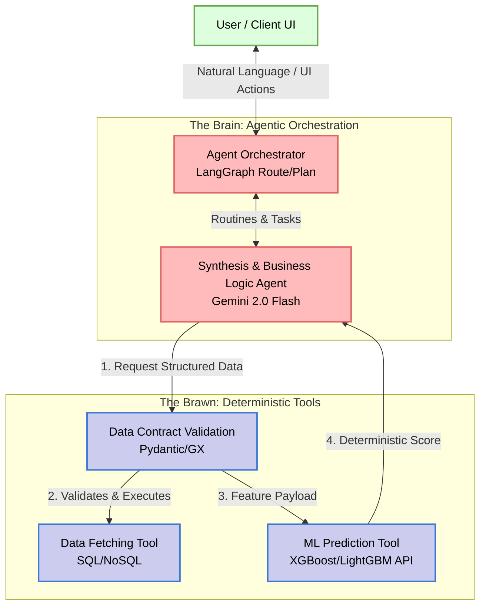
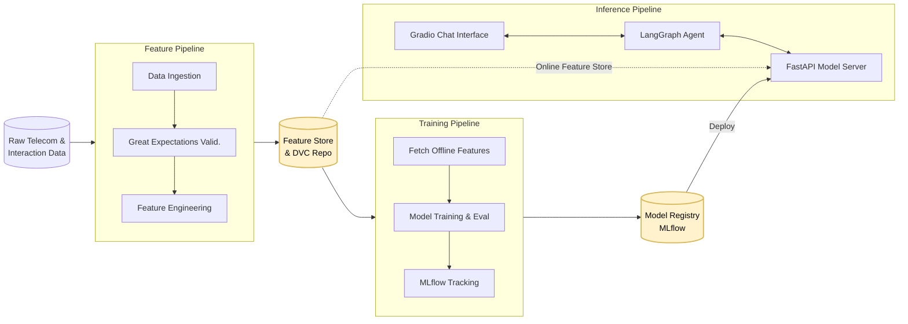

# Telecom Customer Churn Prediction: Agentic MLOps Architecture Report

## 1. Executive Summary

This document presents the comprehensive architecture for the **Telecom Customer Churn Prediction** platform. This project represents a shift from traditional MLOps (Model-Centric) to an **Agentic MLOps** paradigm. It orchestrates intelligent systems by combining deterministic traditional machine learning models (XGBoost/LightGBM) with probabilistic AI Agents (Google Gemini 2.0 Flash + LangGraph) to analyze both quantitative telecom usage metrics and qualitative customer interactions (synthetic ticket notes and sentiment analysis).

The system strictly adheres to the **FTI (Feature, Training, Inference)** pattern and an "Agentic Architecture" standard, ensuring a deep decoupling between data logic, model training, and the intelligent agents serving predictions and business insights.

---

## 2. High-Level Agentic Architecture

At the core of this system is the **Brain vs. Brawn** separation of concerns:
- **The Brain (Agents):** Handled by LangGraph and Gemini 2.0 Flash. They reason, route, interpret business context, and synthesize predictions into actionable strategies. They operate purely on probabilities.
- **The Brawn (Tools):** High-performance microservices (FastAPI), strict data validation (Great Expectations, Pydantic), and deterministic ML models. They are robust, typed, and purely objective.

### 2.1 Brain vs. Brawn Diagram



---

## 3. The FTI Pattern (Feature, Training, Inference)

The traditional ML lifecycle is divided into three completely independent pipelines ensuring high scalability, no training-serving skew, and parallelized development.

### 3.1 Feature Pipeline (Data Engineering)
Responsible for ingesting, validating, and transforming raw telecom data into high-quality predictive signals.
- **Data Contracts:** Uses Great Expectations to ensure schema drift does not corrupt the data.
- **Versioning:** Handled by DVC, generating reproducible data artifacts.
- **Output:** Curated ML Features stored in a Feature Store.

### 3.2 Training Pipeline (Model Development)
Consumes offline versioned data from the Feature Store to train robust ML artifacts.
- **Algorithms:** LightGBM, XGBoost, Scikit-learn.
- **Tracking:** Entire training runs, hyperparameters, metrics (Recall, F1, ROC-AUC), and lineage are tracked meticulously in MLflow. We prioritize **Recall** to minimize the business cost of False Negatives.
- **Output:** Serialized model artifacts passed to the Model Registry.

### 3.3 Inference Pipeline (Model Serving)
Deploys the trained models and integrates them with the Agent ecosystem for the final corporate end-user.
- **Deployment:** A FastAPI microservice serving real-time predictions.
- **Agent Integration:** The API acts as a "Tool" for the LangGraph agent.
- **UI:** A Gradio/Streamlit application offering an Agentic Chat Interface instead of a rigid static table.

### 3.4 FTI Pipeline Diagram



---

## 4. Agent Execution Patterns

To avoid "spaghetti prompt" logic, the system utilizes modular design patterns for LLM communication:

1. **Router Pattern:** A classifier determines whether the user wants to predict churn for a specific user, generate a batch report, or simply ask a query about features. It routes the task to a specialized Agent.
2. **Strategy Pattern:** Agents are injected dynamically based on persona requirement (e.g., highly strict compliance logic vs. high-level business summary).
3. **Structured Outputs:** The agents are restricted to generating Pydantic `BaseModels` to communicate seamlessly with tools (Data loading, ML scoring) eliminating hallucinated tool parameters.

---

## 5. Technology Stack Breakdown

* **Language:** Python 3.11+ (Strict type hinting using `mypy`)
* **Environment/Packaging:** `uv`
* **Agent Orchestration:** `langchain`, `langgraph`, `google-genai` (Gemini 2.0 Flash)
* **Modeling:** `xgboost`, `lightgbm`, `scikit-learn`, `optuna`
* **MLOps/Tracking:** `mlflow`, `dvc`
* **Validation:** `great-expectations`, `pydantic`
* **Serving (The Brawn):** `fastapi`, `uvicorn`
* **UX/UI:** `gradio`
* **Linting/Formatting:** `ruff`

---

## 6. Project Directory Scheme

The codebase strictly shadows the FTI decoupling and Agentic separation.

```text
├── artifacts/              # Pipeline outputs (data, models, GX reports)
├── config/                 # System configuration (YAML)
├── data/                   # Raw and external datasets managed by DVC
├── reports/docs/           # Product and technical documentation
├── src/                    
│   ├── api/                # FastAPI microservice for Inference Serving
│   ├── components/         # Immutable pipeline steps (Data Ingestion, Training)
│   ├── config/             # Configuration management
│   ├── entity/             # Pydantic data contracts and models
│   ├── enrichment/         # Agentic logic, LLM Prompt templates, LangGraph
│   ├── pipeline/           # Orchestration stages (FTI triggers)
│   └── utils/              # Setup scripts, loggers, trace providers
├── tests/                  # Unit tests for tools, Evals for Agents
├── main.py                 # Core CLI entry point
└── dvc.yaml                # DVC orchestration DAG
```

---

## 7. Quality Assurance & Observability

- **Unit Testing:** Standard `pytest` testing for deterministic tools and pipelines to ensure zero runtime errors.
- **Observability (Tracing):** Because agents cannot be debugged with print statements, robust tracing (e.g. LangChain tracing / OpenTelemetry) monitors the Chain of Thought, tool inputs/outputs, and token latency.
- **Fail-Loud Exception Handling:** Custom Python exceptions encapsulate tool failures, providing agents with actionable error messages for self-correction without silently failing.
- **Human-in-the-Loop (HITL):** Key decision junctions requiring business action (e.g., triggering a customer retention offer) require HITL authorization surfaced through the Gradio dashboard.
