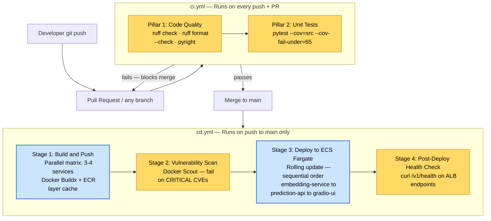
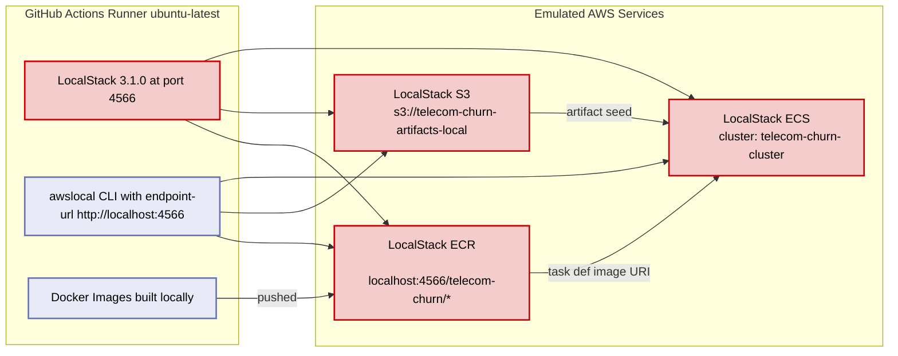
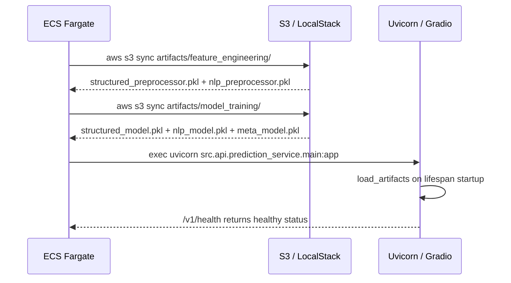
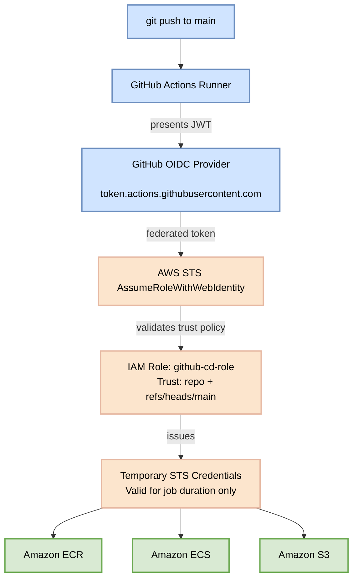
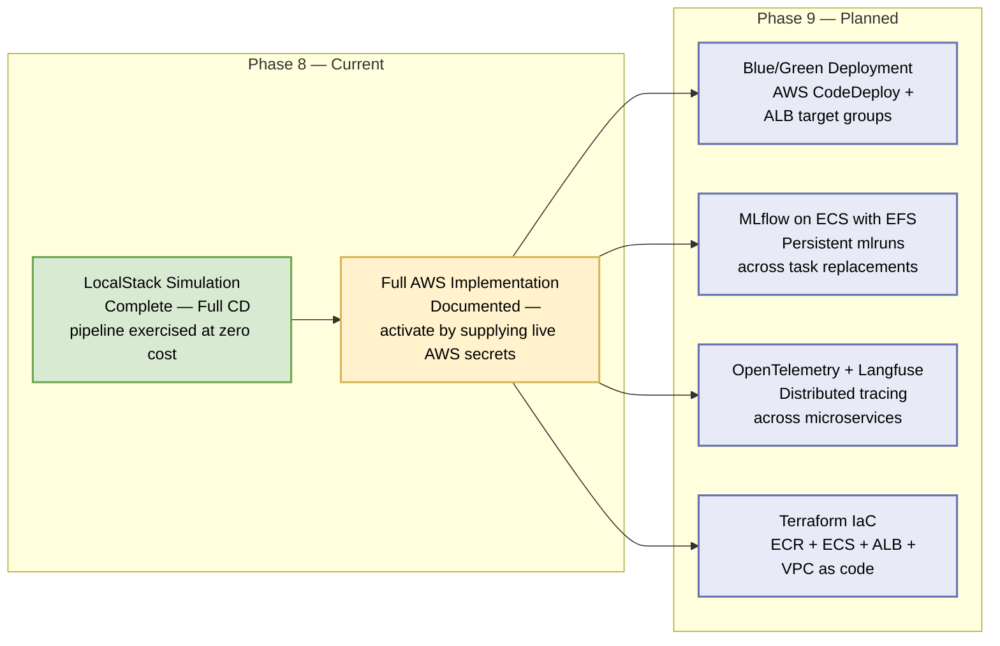

# Phase 8: CI/CD & Cloud Deployment — Architecture Report

> **Status:** ✅ Complete (LocalStack Simulation) | 🔵 Documented (Full AWS — ready for Phase 9 activation)
>
> **Source decisions:** `decisions/aws_deployment.md` · `decisions/cloud_bill_hurdle.md`
> **Workflows:** `workflows/phase_08_local_simulation.md` · `workflows/phase_08_full_implementation.md`
> **Runbook:** `runbooks/aws_actionable_plan.md`

---

## 1. Executive Summary

Phase 8 closes the loop on the **FTI (Feature, Training, Inference)** architecture by adding a **Continuous Integration / Continuous Deployment** layer that automates the delivery of all containerized microservices, from a developer's `git push` to a running production environment.

The phase is executed along **two parallel architectural paths**:

| Path | Target | Status |
|---|---|---|
| **LocalStack Simulation** | AWS services emulated in Docker on the local runner | ✅ Complete |
| **Full AWS Implementation** | Real Fargate / ECR / S3 / IAM — zero code changes required | 🔵 Documented — activate by supplying live credentials |

Both paths are **structurally identical**: the same GitHub Actions YAML files, the same ECS task definitions, the same Docker images. The only difference is the AWS endpoint (`localhost:4566` vs. the public AWS control plane). This guarantees that the LocalStack simulation is a **faithful rehearsal** of a live production deployment, not a simplified mock.

---

## 2. Architectural Decisions

Five formal decisions govern this phase. Every decision was evaluated against at least two options before a recommendation was made, in compliance with the **Comparative Planning** mandate.

### Decision 1 (I) — AWS Authentication Strategy

| | Option I1 — OIDC ✅ **Chosen** | Option I2 — IAM User + Static Keys |
|---|---|---|
| Credential lifetime | Ephemeral (job duration only) | Long-lived (manual rotation required) |
| GitHub Secrets exposure | `AWS_ROLE_ARN` (non-sensitive reference) | `AWS_ACCESS_KEY_ID` + `AWS_SECRET_ACCESS_KEY` |
| Setup complexity | Medium (one-time OIDC provider registration) | Low |
| Security posture | Best practice — principle of least privilege | Violates least-privilege |

**Rationale:** OIDC federation means GitHub Actions never stores a real AWS credential. The runner obtains a short-lived STS token by presenting a signed JWT to AWS IAM, which validates the token against the repository and branch conditions in the role's trust policy. No secrets are rotated; no keys are leaked.

### Decision 2 (J) — ECS Deployment Strategy

| | Option J1 — Rolling Update ✅ **Chosen** | Option J2 — Blue/Green (CodeDeploy) |
|---|---|---|
| Infrastructure overhead | None — default ECS behavior | ALB + CodeDeploy + target group pair |
| Rollback mechanism | Previous task definition revision | Instant traffic reroute |
| Downtime | Zero (stateless services) | Zero |
| Appropriate for SLA | < 99.9% | ≥ 99.9% |

**Rationale:** Blue/Green is the correct pattern when SLAs demand sub-second rollback. For a portfolio project without a defined SLA, rolling update provides the identical zero-downtime guarantee with no additional infrastructure cost. Blue/Green is the natural Phase 9 migration path once SLA requirements are formally defined.

### Decision 3 (K) — ECS Service Scope

| | Option K2 — Three Customer-Facing Services ✅ **Chosen** | Option K1 — All Four Services |
|---|---|---|
| Services deployed | `embedding-service`, `prediction-api`, `gradio-ui` | All four (+ `mlflow-server`) |
| MLflow storage | Local / EC2 | EFS mount — VPC subnet routing required |
| Portfolio value | High — three customer-facing services visible | Same, plus internal tooling overhead |

**Rationale:** `mlflow-server` is an internal tool. Running it on Fargate requires EFS for `mlruns/` persistence — a non-trivial VPC/subnet/mount-target configuration that adds cost and complexity without demonstrating additional MLOps engineering skill. The task definition for `mlflow-server` is delivered as an artifact so Phase 9 can activate it without any code changes.

### Decision 4 (L) — Artifact Delivery to Fargate

| | Option L1 — S3 Fetch at Startup ✅ **Chosen** | Option L2 — Bake into Image | Option L3 — EFS Mount |
|---|---|---|---|
| Separation of concerns | ✅ Data = DVC, Code = Docker | ❌ Data tightly coupled to image | ✅ Mirror of local bind mount |
| Image size | Unchanged | Larger (+~5 MB) | Unchanged |
| Infrastructure | S3 bucket + IAM `s3:GetObject` | None | VPC, EFS, mount targets, access points |
| Cold-start penalty | ~1–2 s for 5 MB artifacts | None | None |

**Rationale:** ML artifacts are DVC-managed data, not application code. Keeping them separate enforces the FTI principle that the **Feature Store** and **Model Registry** are independent of the **Inference Pipeline** container. The cold-start penalty for ~5 MB of `.pkl` files is negligible. The startup script conditionally appends `--endpoint-url $AWS_ENDPOINT_URL` to every `aws s3 sync` call — identical behavior in LocalStack and real AWS.

### Decision 5 (M) — Cloud Provider Target

| | Option M1 — LocalStack Simulation ✅ **Chosen** | Option M2 — Live AWS |
|---|---|---|
| Cost | $0 | Fargate compute + ECR storage + ALB |
| Credit card required | No | Yes |
| AWS architectural parity | 100% — same IaC, same CLI commands | 100% |
| Activation path | Supply live credentials | Already documented |

**Rationale:** The "Cloud Bill Hurdle" (`decisions/cloud_bill_hurdle.md`) made a live AWS account impractical for this phase. LocalStack 3.1.0 (Community) provides full fidelity for S3, ECR, and ECS at `localhost:4566`. The entire AWS-specific code (Terraform provider, GitHub Actions, task definitions, entrypoint script) is written **without any LocalStack-specific logic** — switching to real AWS requires only
supplying live GitHub Secrets.

---

## 3. CI/CD Pipeline Architecture

The pipeline follows **trunk-based development**: all quality gates are enforced on every branch via CI; deployment to the cloud environment occurs only on `main`.



### 3.1 CI Workflow (`ci.yml`)

**Trigger:** `push` to any branch + `pull_request` targeting `main`.

**Design choice — single job:** The two pillars run in one job sharing a single `uv`-managed virtual environment. Splitting into a parallel matrix would add runner startup overhead (≥ 30 s per runner) that exceeds the total quality-check runtime (< 3 min).

```
jobs:
  quality:
    runs-on: ubuntu-latest
    steps:
      - checkout
      - setup uv (cached pip resolver)
      - uv sync --all-extras
      - ruff check src/ tests/
      - ruff format --check src/ tests/
      - pyright
      - pytest --cov=src --cov-fail-under=65 --tb=short
```

**Gate semantics:** Any step failure exits non-zero, and the GitHub branch protection rule `Require status checks to pass before merging` blocks the PR. Code never enters `main` with a failing type check, lint error, or test regression.

### 3.2 CD Workflow (`cd.yml`)

**Trigger:** `push` to `main` only (post-merge).

**Concurrency control:**
```yaml
concurrency:
  group: cd-main
  cancel-in-progress: false   # never cancel a running deployment
```
Only one deployment may run simultaneously. A second `main` push queues rather than cancels the active deployment, preventing partial-rollout race conditions.

#### Stage 1 — Build & Push (parallel matrix)

```yaml
strategy:
  fail-fast: false
  matrix:
    include:
      - service: embedding-service
        dockerfile: docker/embedding_service/Dockerfile
        ecr_repo:   telecom-churn/embedding-service
      - service: prediction-api
        dockerfile: docker/prediction_api/Dockerfile
        ecr_repo:   telecom-churn/prediction-api
      - service: gradio-ui
        dockerfile: docker/gradio_ui/Dockerfile
        ecr_repo:   telecom-churn/gradio-ui
      - service: mlflow-server
        dockerfile: docker/mlflow_server/Dockerfile
        ecr_repo:   telecom-churn/mlflow-server
```

Each image is tagged with **two tags**:
- `{ECR_REGISTRY}/{repo}:{github.sha}` — immutable, pinned to the exact commit.
- `{ECR_REGISTRY}/{repo}:latest` — mutable, always points to the latest main build.

The deploy job references the **SHA tag** exclusively, ensuring that a rolling update cannot pull an image that was pushed by a concurrent build.

**Layer caching:** `docker/build-push-action@v6` stores the build cache in ECR itself (`buildcache` tag). No external cache backend (GitHub Cache, S3) is required.

#### Stage 2 — Docker Scout CVE Scan

```yaml
- uses: docker/scout-action@v1
  with:
    command:     cves
    severity:    critical
    only-fixed:  true
    exit-code:   true
```

**Policy rationale:** Blocking only on `critical` + `only-fixed` avoids build failures on unfixable CVEs in base OS packages, a common source of false-positive CI blocks in production pipelines. `high` CVEs are reported in the job log but do not block release.

#### Stage 3 — Deploy to ECS Fargate (sequential, dependency-ordered)

```
embedding-service   (deploys first — prediction-api depends on its /v1/embed endpoint)
  wait-for-service-stability: true
prediction-api      (deploys second — gradio-ui depends on its /v1/predict endpoint)
  wait-for-service-stability: true
gradio-ui           (deploys last — user-facing layer)
```

Each service uses `aws-actions/amazon-ecs-render-task-definition@v1` to inject the immutable SHA-tagged image URI into the JSON task definition, then `aws-actions/amazon-ecs-deploy-task-definition@v2` to register the new revision and trigger the rolling update. The action polls ECS until the service reaches steady state (`wait-for-minutes: 10`) before proceeding to the next service.

**`mlflow-server`** is pushed to ECR in Stage 1 but not deployed in Stage 3 (Decision K2). Its task definition lives in `task-definitions/mlflow-server.json` and can be activated in Phase 9 without any workflow changes.

#### Stage 4 — Post-Deploy Health Check

```bash
curl -sf --max-time 10 "http://${ALB_DNS_PRED}/v1/health"   | python3 -m json.tool
curl -sf --max-time 10 "http://${ALB_DNS_GRADIO}/" > /dev/null && echo "200 OK"
```

ALB DNS names are stored as GitHub Actions **variables** (not secrets). Health check failure at this stage triggers a job failure, making the deployment visible in GitHub without an automatic rollback (ECS keeps the previous task definition revision active as a rollback baseline).

---

## 4. LocalStack Simulation Architecture

The LocalStack path replaces every real AWS endpoint with `http://localhost:4566`, running inside the GitHub Actions runner via the `localstack/setup-localstack@v0.2.2` action.



### 4.1 LocalStack Provisioning Sequence

```bash
# 1. Create ECR repositories
awslocal ecr create-repository --repository-name telecom-churn/embedding-service
awslocal ecr create-repository --repository-name telecom-churn/prediction-api
awslocal ecr create-repository --repository-name telecom-churn/gradio-ui
awslocal ecr create-repository --repository-name telecom-churn/mlflow-server

# 2. Create S3 artifact bucket and seed with model artifacts
awslocal s3 mb s3://telecom-churn-artifacts-local
awslocal s3 sync /workspace/artifacts/ s3://telecom-churn-artifacts-local/artifacts/

# 3. Create ECS cluster
awslocal ecs create-cluster --cluster-name telecom-churn-cluster
```

### 4.2 cd.yml — LocalStack Variant

```yaml
jobs:
  localstack-deploy:
    runs-on: ubuntu-latest
    steps:
      - uses: actions/checkout@v4
      - uses: localstack/setup-localstack@v0.2.2
      - name: Configure dummy AWS credentials
        run: |
          echo "AWS_ACCESS_KEY_ID=test"               >> $GITHUB_ENV
          echo "AWS_SECRET_ACCESS_KEY=test"           >> $GITHUB_ENV
          echo "AWS_DEFAULT_REGION=us-east-1"         >> $GITHUB_ENV
          echo "AWS_ENDPOINT_URL=http://localhost:4566" >> $GITHUB_ENV
      - name: Init LocalStack resources    # ECR + S3 + ECS via awslocal
      - name: Build images                 # standard docker build
      - name: Push images to LocalStack ECR  # localhost:4566/telecom-churn/*
      - name: Register task definitions    # sed rewrites ACCOUNT_ID / REGION
      - name: Update ECS services          # awslocal ecs create-service --launch-type FARGATE
```

**Key parity mechanism:** The `cd.yml` for LocalStack uses `sed` to replace `ACCOUNT_ID` and `REGION` placeholders in the task definition JSONs with mock values before calling `awslocal ecs register-task-definition`. This is the **only** structural difference from the real AWS workflow, the logic, ordering, and health check steps are identical.

### 4.3 Local Development Stack (docker-compose.yaml)

The full local development environment adds `localstack` as a fifth container alongside the four application services:

```yaml
localstack:
  image: localstack/localstack:3.1.0
  ports:
    - "4566:4566"
    - "4510-4559:4510-4559"
  environment:
    - SERVICES=s3,ecr,ecs
    - DEBUG=0
  volumes:
    - localstack_data:/var/lib/localstack

embedding-service:
  environment:
    - AWS_ENDPOINT_URL=http://localstack:4566
    - ARTIFACTS_S3_BUCKET=telecom-churn-artifacts-local

prediction-api:
  environment:
    - AWS_ENDPOINT_URL=http://localstack:4566
    - ARTIFACTS_S3_BUCKET=telecom-churn-artifacts-local

gradio-ui:
  environment:
    - AWS_ENDPOINT_URL=http://localstack:4566
    - ARTIFACTS_S3_BUCKET=telecom-churn-artifacts-local
```

---

## 5. Artifact Delivery Pattern (Decision L1)

The startup entrypoint script is the bridge between the **DVC-managed Feature Store / Model Registry** and the running Fargate container. It replaces the local Docker Compose bind mount (`./artifacts:/app/artifacts`) that cannot exist on Fargate.

```bash
#!/bin/bash
# docker/entrypoint.sh — shared across all three services

ENDPOINT_FLAG=""
if [ -n "$AWS_ENDPOINT_URL" ]; then
    ENDPOINT_FLAG="--endpoint-url $AWS_ENDPOINT_URL"
fi

echo "Syncing artifacts from S3..."
aws s3 sync \
    "s3://${ARTIFACTS_S3_BUCKET}/artifacts/feature_engineering/" \
    "/app/artifacts/feature_engineering/" \
    $ENDPOINT_FLAG

aws s3 sync \
    "s3://${ARTIFACTS_S3_BUCKET}/artifacts/model_training/" \
    "/app/artifacts/model_training/" \
    $ENDPOINT_FLAG

exec "$@"
```



**Robustness notes:**
- The `exec "$@"` pattern ensures the service process inherits the PID 1 slot, critical for receiving SIGTERM from ECS during rolling update drains.
- The `[ -n "$AWS_ENDPOINT_URL" ]` guard ensures the script works unmodified in both LocalStack and real AWS environments.
- For ~5 MB of `.pkl` files the S3 sync completes in < 2 s; ECS health check grace periods accommodate this.

---

## 6. ECS Task Definition Design

All four task definitions follow an identical structure. Key parameters:

```json
{
  "family":                   "telecom-churn-{service}",
  "networkMode":              "awsvpc",
  "requiresCompatibilities":  ["FARGATE"],
  "cpu":                      "512",
  "memory":                   "1024",
  "executionRoleArn":         "arn:aws:iam::ACCOUNT_ID:role/ecsTaskExecutionRole",
  "taskRoleArn":              "arn:aws:iam::ACCOUNT_ID:role/ecsTaskRole",
  "containerDefinitions": [{
    "image":         "ACCOUNT_ID.dkr.ecr.REGION.amazonaws.com/telecom-churn/{service}:latest",
    "portMappings":  [{ "containerPort": "PORT" }],
    "environment":   [{ "name": "ARTIFACTS_S3_BUCKET", "value": "REPLACE_WITH_BUCKET_NAME" }],
    "logConfiguration": {
      "logDriver": "awslogs",
      "options": {
        "awslogs-group":         "/ecs/telecom-churn/{service}",
        "awslogs-region":        "us-east-1",
        "awslogs-stream-prefix": "ecs"
      }
    },
    "healthCheck": { "command": ["CMD-SHELL", "curl -f http://localhost:PORT/v1/health || exit 1"] }
  }]
}
```

### 6.1 Per-Service Resource Allocations

| Service | CPU | Memory | Reason |
|---|---|---|---|
| `embedding-service` | 1024 (1 vCPU) | 2048 MB | SentenceTransformer model requires ~1.3 GB resident memory |
| `prediction-api` | 512 (0.5 vCPU) | 1024 MB | Four `.pkl` artifacts; no large model in memory |
| `gradio-ui` | 512 (0.5 vCPU) | 1024 MB | Stateless UI; heavy compute delegated to prediction-api |
| `mlflow-server` | 512 (0.5 vCPU) | 1024 MB | Tracking server only; pushed to ECR, not deployed (Phase 9) |

### 6.2 IAM Role Separation

| Role | Purpose | Permissions |
|---|---|---|
| `ecsTaskExecutionRole` | ECS agent — pull image from ECR, push logs to CloudWatch | AWS-managed `AmazonECSTaskExecutionRolePolicy` |
| `ecsTaskRole` | Application code — fetch artifacts from S3 | `s3:GetObject` + `s3:ListBucket` scoped to artifact bucket |

This mirrors the **Brain vs. Brawn** principle: the ECS control plane (execution role) is separated from the application runtime (task role).

### 6.3 Placeholder Map

| Placeholder | Replace With |
|---|---|
| `ACCOUNT_ID` | 12-digit AWS account ID (`secrets.AWS_ACCOUNT_ID`) |
| `REGION` | AWS region (e.g., `us-east-1`) |
| `REPLACE_WITH_BUCKET_NAME` | S3 artifact bucket name |
| `REPLACE_WITH_EMBEDDING_SERVICE_INTERNAL_DNS` | Service discovery or ALB internal endpoint |
| `REPLACE_WITH_PREDICTION_API_INTERNAL_URL` | Internal URL for prediction-api |

---

## 7. Pre-Commit Quality Gate

```yaml
# .pre-commit-config.yaml
repos:
  - repo: https://github.com/astral-sh/ruff-pre-commit
    hooks:
      - id: ruff           # Pillar 1 lint — mirrors CI exactly
      - id: ruff-format    # Pillar 1 format — mirrors CI exactly

  - repo: https://github.com/RobertCraigie/pyright-python
    hooks:
      - id: pyright        # Type check — mirrors CI exactly

  - repo: https://github.com/pre-commit/pre-commit-hooks
    hooks:
      - id: trailing-whitespace
      - id: end-of-file-fixer
      - id: check-yaml
      - id: check-json
      - id: check-toml
      - id: detect-private-key       # Blocks accidental credential commits
      - id: check-added-large-files  # Blocks model/data files > 5 MB

  - repo: local
    hooks:
      - id: no-artifacts-in-git      # Forces DVC workflow
      - id: no-env-files             # Enforces .env.example pattern
```

### Gate Responsibility Matrix

| Gate | Local pre-commit | CI (ci.yml) | CD (cd.yml) |
|---|---|---|---|
| Ruff lint + format | ✅ | ✅ | — |
| Pyright type check | ✅ | ✅ | — |
| pytest ≥ 65% coverage | — | ✅ | — |
| Credential / large file guard | ✅ | — | — |
| DVC artifact enforcement | ✅ | — | — |
| Docker Scout CVE scan | — | — | ✅ |
| ECS health check | — | — | ✅ |

---

## 8. Security Architecture



**Key security properties:**

1. **No long-lived secrets in GitHub** — `AWS_ROLE_ARN` is a resource identifier. A leaked ARN cannot authenticate without a valid GitHub-issued JWT.
2. **Repository + branch scoping** — the IAM trust condition `"token.actions.githubusercontent.com:sub": "repo:ORG/REPO:ref:refs/heads/main"` prevents any other repository or branch from assuming the role.
3. **Session naming** — `role-session-name: github-cd-{run_id}` makes every deployment traceable in AWS CloudTrail logs.
4. **Principle of least privilege** — the role has `ecr:*` and `ecs:*` scoped to `telecom-churn-*` resources only; `s3:GetObject` is scoped to the artifact bucket ARN.

---

## 9. Required GitHub Configuration

### Secrets (sensitive — stored encrypted)

| Secret | Value |
|---|---|
| `AWS_ROLE_ARN` | `arn:aws:iam::ACCOUNT_ID:role/github-cd-role` |
| `AWS_ACCOUNT_ID` | 12-digit account ID |
| `AWS_REGION` | e.g., `us-east-1` |
| `ECR_REGISTRY` | `ACCOUNT_ID.dkr.ecr.REGION.amazonaws.com` |
| `ARTIFACTS_S3_BUCKET` | S3 bucket name for DVC artifacts |
| `ECS_CLUSTER` | ECS cluster name |
| `DOCKER_HUB_USERNAME` | Docker Hub username (Docker Scout auth) |
| `DOCKER_HUB_TOKEN` | Docker Hub access token (Docker Scout auth) |

> **LocalStack path:** Replace all AWS secrets with `test` / `us-east-1` / dummy
> values. The `localstack/setup-localstack` action handles the rest automatically.

### Variables (non-sensitive — stored in plaintext)

| Variable | Value |
|---|---|
| `ALB_DNS_PRED` | ALB DNS hostname for prediction-api |
| `ALB_DNS_GRADIO` | ALB DNS hostname for gradio-ui |

---

## 10. Files Delivered

### New Files

| File | Purpose |
|---|---|
| `.github/workflows/ci.yml` | Continuous Integration — code quality + tests on every push |
| `.github/workflows/cd.yml` | Continuous Deployment — build, scan, push, deploy on main |
| `task-definitions/embedding-service.json` | ECS Fargate task definition |
| `task-definitions/prediction-api.json` | ECS Fargate task definition |
| `task-definitions/gradio-ui.json` | ECS Fargate task definition |
| `task-definitions/mlflow-server.json` | ECS Fargate task definition (Phase 9 reference) |
| `.pre-commit-config.yaml` | Pre-commit quality gate hooks |
| `docker/entrypoint.sh` | S3-fetch startup script (shared across three services) |

### Modified Files

| File | Change |
|---|---|
| `docker-compose.yaml` | + LocalStack service; + `AWS_ENDPOINT_URL` env vars; activate `gradio-ui` |
| `.env.example` | + `AWS_ACCESS_KEY_ID=test`, `AWS_SECRET_ACCESS_KEY=test`, `AWS_ENDPOINT_URL`, `ARTIFACTS_S3_BUCKET` |
| `Makefile` | + `ecr-login`, `ecr-push`, `deploy`, `artifacts-push`, `localstack-init`, `pre-commit-install` targets |
| `Dockerfiles` (x3) | + `awscli` install; + `COPY docker/entrypoint.sh` |
| `validate_system.sh` | + Pillar 4: ECR connectivity pre-check |

---

## 11. Dual-Path Deployment Roadmap



The Phase 9 migration from LocalStack to real AWS requires **zero code changes**:
1. Replace dummy GitHub Secrets with live AWS values.
2. Run the one-time AWS infrastructure setup (ECR repos, S3 bucket, ECS cluster, OIDC provider, IAM roles).
3. Merge any branch to `main` — the CD workflow fires automatically.

---

## 12. Production Readiness Checklist

| Concern | Implementation |
|---|---|
| **Authentication security** | OIDC — no long-lived secrets in any system |
| **Image immutability** | SHA-tagged images — deploy job cannot pull a different image than CI built |
| **Supply chain security** | Docker Scout CVE scan — blocks on unpatched critical vulnerabilities |
| **Dependency-ordered rollout** | embedding-service → prediction-api → gradio-ui |
| **Startup artifact delivery** | entrypoint.sh S3 sync — identical behavior in LocalStack and real AWS |
| **Graceful shutdown** | `exec` PID 1 — containers receive SIGTERM from ECS drain |
| **Health-gated progression** | `wait-for-service-stability: true` before next service deploys |
| **Pre-commit local gates** | Credential guard, large-file guard, DVC artifact enforcement |
| **Rollback baseline** | ECS retains previous task definition revision |
| **Cost governance** | Decision K2: MLflow not deployed to ECS; Decision L1: no EFS |
| **Observability** | CloudWatch Logs via `awslogs` driver on all four task definitions |

---

> **Related Documents:**
> - [architecture.md](architecture.md) — Full system architecture (Phases 1–8)
> - [inference.md](inference.md) — FastAPI microservice architecture
> - [gradio_ui.md](gradio_ui.md) — Gradio dashboard + containerization (Phase 7)
> - [decisions/aws_deployment.md](../decisions/aws_deployment.md) — Formal decision log
> - [decisions/cloud_bill_hurdle.md](../decisions/cloud_bill_hurdle.md) — LocalStack rationale
> - [runbooks/aws_actionable_plan.md](../runbooks/aws_actionable_plan.md) — Step-by-step execution guide
