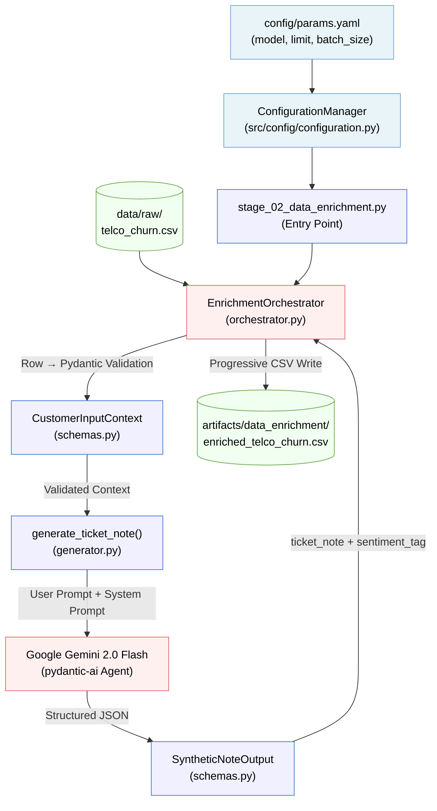

# Phase 2: Agentic Data Enrichment — Architecture Report

## 1. Purpose

The Data Enrichment phase synthesizes **"Soft Signals"** (qualitative sentiment) from **"Hard Signals"** (quantitative behavioral data) to fill the qualitative gap in the raw Telco dataset. It does so using an
Agentic pipeline powered by **pydantic-ai** and **Google Gemini 2.0 Flash**, producing structured,
validated ticket notes and sentiment tags for every customer row.

> **MLOps Principle (Agentic Architecture):** The Agent (Brain) does not compute. It reasons and routes.
> Deterministic data transformation is delegated to validated Tools (Brawn). The enrichment pipeline
> enforces this by using Pydantic schemas as the contract boundary between the raw DataFrame and the LLM.

**Framework Decision:** Since this phase requires rigid structured outputs and orchestration, we recommend using either `LangChain/LangGraph` or `pydantic-ai` to build the Generation microservice. Both fulfill the "Structured Output Enforcement" rule, but `pydantic-ai` offers faster deterministic schema validation inside Python without heavy abstractions.

---

## 2. Component Architecture

All enrichment logic lives inside `src/components/data_enrichment/`, following the
**Components / Pipeline** separation principle.

```
src/
├── components/
│   └── data_enrichment/           ← Business Logic (The "How")
│       ├── __init__.py
│       ├── schemas.py             ← Pydantic I/O contracts for the Agent
│       ├── prompts.py             ← Versioned system prompt template
│       ├── generator.py           ← Core LLM tool (pydantic-ai Agent)
│       └── orchestrator.py        ← Async batch processor & CSV writer
└── pipeline/
    └── stage_02_data_enrichment.py  ← Execution Stage (The "Conductor")
```

### Component Responsibilities

| File | Role | Pattern |
|---|---|---|
| `schemas.py` | Input/output Pydantic contracts | Data Contract |
| `prompts.py` | Versioned system prompt | Separation of Concerns |
| `generator.py` | Single-row LLM tool call | Brawn (Deterministic Tool) |
| `orchestrator.py` | Batch async processor | Parallel Agent Pattern |
| `stage_02_data_enrichment.py` | Pipeline entry point | FTI Feature Pipeline Stage |

---

## 3. Data Flow



---

## 4. Pydantic Data Contracts

### 4.1 Input Contract: `CustomerInputContext`

Every row of the raw CSV is validated against this schema **before** being passed to the LLM,
enforcing the "garbage in, garbage out" prevention rule.

| Field | Type | Constraint | Business Reason |
|---|---|---|---|
| `customerID` | `str` | Required | Row identifier for traceability |
| `tenure` | `int` | `>= 0` | Cannot have negative tenure |
| `InternetService` | `Literal` | `DSL / Fiber optic / No` | Only known categories |
| `Contract` | `Literal` | `Month-to-month / One year / Two year` | Only known categories |
| `MonthlyCharges` | `float` | `>= 0` | Cannot have negative charges |
| `TechSupport` | `Literal` | `Yes / No / No internet service` | Only known categories |
| `Churn` | `Literal` | `Yes / No` | Binary label, no ambiguity allowed |

### 4.2 Output Contract: `SyntheticNoteOutput`

Guarantees that the LLM output is **always parseable** and **categorically valid** before being written to disk.

| Field | Type | Constraint |
|---|---|---|
| `ticket_note` | `str` | Required, non-empty |
| `primary_sentiment_tag` | `Literal` | `Frustrated / Neutral / Satisfied / Billing Inquiry / Technical Issue` |

---

## 5. Resiliency: Deterministic Fallback

The `generate_ticket_note()` function implements **Agentic Healing**. If the LLM API fails
(network error, rate limit, auth error) after 3 built-in retries, it falls back to a
**deterministic rule-based note** derived from the customer's `Churn` status and service type.

```
LLM Call (3 retries)
   ├── SUCCESS → Return SyntheticNoteOutput from LLM
   └── FAILURE → fallback()
           ├── Churn == Yes → Frustrated note (deterministic)
           └── Churn == No → Satisfied note (deterministic)
```

This ensures **pipeline continuity** during development or API outages without silent failures.

---

## 6. Configuration

All enrichment parameters are centralized in `config/params.yaml` and hydrated via `ConfigurationManager`
into the `DataEnrichmentConfig` frozen dataclass before the pipeline runs.

| Parameter | Location | Default | Purpose |
|---|---|---|---|
| `model_name` | `params.yaml` | `gemini-2.0-flash` | LLM model selection |
| `limit` | `params.yaml` | `10` | Rows to process (`0` = all) |
| `batch_size` | `DataEnrichmentConfig` | `20` | Concurrent API calls |

> **Reproducibility Note:** The `limit` is tracked in `params.yaml` under DVC. This ensures
> that every `dvc repro` run uses the exact same slice of data, making experiments fully
> reproducible without relying on environment variables.

---

## 7. DVC Integration

The enrichment stage is registered in `dvc.yaml` as the `enrich_data` stage.

```yaml
enrich_data:
  cmd: uv run python -m src.pipeline.stage_02_data_enrichment
  deps:
    - data/raw/WA_Fn-UseC_-Telco-Customer-Churn.csv
    - src/pipeline/stage_02_data_enrichment.py
    - src/components/data_enrichment/orchestrator.py
    - src/components/data_enrichment/generator.py
    - src/components/data_enrichment/schemas.py
    - src/components/data_enrichment/prompts.py
    - config/params.yaml
  outs:
    - artifacts/data_enrichment/enriched_telco_churn.csv
```

DVC tracks the `config/params.yaml` as a dependency, so any change to `model_name`, `limit`,
or other enrichment parameters will invalidate the cache and force re-execution.

---

## 8. Output Artifact

**Path:** `artifacts/data_enrichment/enriched_telco_churn.csv`

The output artifact is the raw Telco dataset with two new columns appended:

| Column | Type | Description |
|---|---|---|
| `ticket_note` | `str` | AI-generated customer interaction log (1–3 sentences) |
| `primary_sentiment_tag` | `str` | Validated categorical sentiment label |

This artifact is the input for **Stage 3 (Enriched Data Validation)** and ultimately
the **Feature Store** for the ML Training Pipeline.
