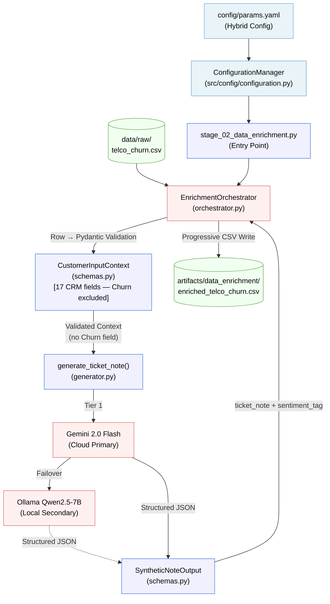

# Phase 2: Agentic Data Enrichment — Architecture Report

## 1. Purpose

The Data Enrichment phase synthesizes **"Soft Signals"** (qualitative sentiment) from
**"Hard Signals"** (quantitative behavioral data) to fill the qualitative gap in the raw
Telco dataset. It uses a **Hybrid Agentic Pipeline** powered by **pydantic-ai**, combining
Google Gemini 2.0 Flash with local Ollama fallbacks. It produces structured, validated ticket
notes and sentiment tags for every customer row.

> **MLOps Principle (Agentic Architecture):** The Agent (Brain) does not compute. It reasons
> and routes. Deterministic data transformation is delegated to validated Tools (Brawn). The
> enrichment pipeline enforces this by using Pydantic schemas as the contract boundary between
> the raw DataFrame and the LLM.

**Framework Decision:** `pydantic-ai` was selected over `LangChain/LangGraph` for this phase
because it offers faster deterministic schema validation inside Python without heavy
abstractions, aligning with the "Strict Typing" and "Production-Readiness" rules for this
project.

---

## 2. Component Architecture

```
src/
├── components/
│   └── data_enrichment/           ← Business Logic (The "How")
│       ├── __init__.py
│       ├── schemas.py             ← Pydantic I/O contracts for the Agent
│       ├── prompts.py             ← Versioned system prompt template
│       ├── generator.py           ← Core LLM tool (Hybrid Strategy)
│       └── orchestrator.py        ← Async batch processor & CSV writer
└── pipeline/
    └── stage_02_data_enrichment.py  ← Execution Stage (The "Conductor")
```

| File | Role | Pattern |
|---|---|---|
| `schemas.py` | Input/output Pydantic contracts | Data Contract |
| `prompts.py` | Versioned system prompt | Separation of Concerns |
| `generator.py` | Hybrid Provider Management | Strategy Pattern |
| `orchestrator.py` | Batch async processor | Parallel Agent Pattern |
| `stage_02_data_enrichment.py` | Pipeline entry point | FTI Feature Pipeline Stage |

---

## 3. Data Flow



---

## 4. Pydantic Data Contracts

### 4.1 Input Contract: `CustomerInputContext` (C1 Enhanced)

Every row of the raw CSV is validated against this schema **before** being passed to the LLM.

> **C1 Leakage Fix:** The original schema contained 7 fields including `Churn`. This caused
> the LLM to encode the target label directly into ticket note embeddings, producing
> near-perfect NLP branch predictions (Recall=1.000, ROC-AUC=0.9999) that were invalid for
> production use. The schema was redesigned to expose 17 observable CRM fields — all signals
> a real support agent would see during a live call — with `Churn` permanently excluded.

| Field | Type | Constraint | Business Reason |
|---|---|---|---|
| `customerID` | `str` | Required | Row identifier for traceability |
| `tenure` | `int` | `>= 0` | Cannot have negative tenure |
| `gender` | `str` | Required | CRM demographic field |
| `SeniorCitizen` | `int` | `[0, 1]` | Binary flag |
| `Partner` | `str` | Required | Household context |
| `Dependents` | `str` | Required | Household context |
| `InternetService` | `Literal` | `DSL / Fiber optic / No` | Only known categories |
| `OnlineSecurity` | `Literal` | `Yes / No / No internet service` | Service add-on status |
| `OnlineBackup` | `Literal` | `Yes / No / No internet service` | Service add-on status |
| `DeviceProtection` | `Literal` | `Yes / No / No internet service` | Service add-on status |
| `TechSupport` | `Literal` | `Yes / No / No internet service` | Service add-on status |
| `StreamingTV` | `Literal` | `Yes / No / No internet service` | Service add-on status |
| `StreamingMovies` | `Literal` | `Yes / No / No internet service` | Service add-on status |
| `Contract` | `Literal` | `Month-to-month / One year / Two year` | Only known categories |
| `PaperlessBilling` | `str` | Required | Billing preference |
| `PaymentMethod` | `str` | Required | Payment channel |
| `MonthlyCharges` | `float` | `>= 0` | Cannot have negative charges |
| ~~`Churn`~~ | ~~`Literal`~~ | **Removed (C1 fix)** | **Target variable — must never reach the LLM** |

### 4.2 Output Contract: `SyntheticNoteOutput`

Guarantees that the LLM output is always parseable and categorically valid before being
written to disk.

| Field | Type | Constraint |
|---|---|---|
| `ticket_note` | `str` | Required, non-empty |
| `primary_sentiment_tag` | `Literal` | `Frustrated / Dissatisfied / Neutral / Satisfied / Billing Inquiry / Technical Issue` |

---

## 5. Resiliency: The 3-Tier Fallback Chain

`generator.py` implements a nested fallback strategy for 100% pipeline reliability:

1. **Tier 1: Cloud Primary (Google Gemini 2.0 Flash)** — 3 automatic retries via pydantic-ai.
2. **Tier 2: Local Secondary (Ollama: Qwen2.5-7B)** — triggered on persistent API failures.
3. **Tier 3: Deterministic Fallback (Rule-Based)** — last resort when both LLMs are unavailable.

> **C1 Enhancement — Tier 3 Rewrite:** The original fallback branched on `customer_context.Churn`
> to produce "Frustrated" (Churn=Yes) or "Satisfied" (Churn=No) notes. This was leakage in the
> last-resort path. The fallback was rewritten using five observable feature-signal branches:
> high-friction profile (Fiber + no TechSupport + month-to-month), price-sensitive
> (high charges + month-to-month), technical issue (no security/backup), loyal long-term
> (two-year contract), and new customer (tenure ≤ 6). No target-variable reference anywhere.

---

## 6. System Prompt Design (C1 Enhanced)

> **C1 Enhancement:** The original system prompt contained explicit `LOGIC GATES` conditioning
> generation on `Churn=Yes/No` (e.g., *"If `Churn=Yes`, the note MUST be negative"*). All
> churn-conditional gates were removed. The prompt now adopts a CRM-agent persona: the LLM
> writes a note as a support agent would immediately after a live call, based only on observable
> service signals. Frustration can emerge legitimately from high charges + no tech support,
> but never from label knowledge.

The leakage-free prompt instructs:
- Write from the perspective of a support agent **during a call** (before any churn decision).
- Ground notes in observable signals: contract type, charges, service configuration, tenure.
- Explicitly prohibit references to cancellation, switching, or churn intent.
- Sentiment selection guide based on service profile only (not outcome).

---

## 7. Configuration

All enrichment parameters are centralized in `config/params.yaml`.

| Parameter | Value | Purpose |
|---|---|---|
| `model_provider` | `hybrid` | Enables the 3-tier fallback chain |
| `model_name` | `gemini-2.0-flash` | Primary cloud model |
| `secondary_model_name` | `ollama:qwen2.5:7b` | Local fallback model |
| `batch_size` | `2` | Optimised for Gemini Free Tier (15 RPM) |
| `limit` | `0` | Process entire dataset (7,043 rows) |

---

## 8. DVC Integration

The enrichment stage is registered in `dvc.yaml` as the `enrich_data` stage. `schemas.py`
and `prompts.py` are declared as dependencies, so any change to the input contract or system
prompt automatically invalidates the cache and forces a full re-run.

```yaml
enrich_data:
    cmd: uv run python -m src.pipeline.stage_02_data_enrichment
    deps:
        - src/components/data_enrichment/schemas.py    ← schema changes invalidate cache
        - src/components/data_enrichment/prompts.py    ← prompt changes invalidate cache
        - src/components/data_enrichment/generator.py
        - src/components/data_enrichment/orchestrator.py
        - config/params.yaml
        ...
    outs:
        - artifacts/data_enrichment/enriched_telco_churn.csv:
            persist: true
```

---

## 9. Output Artifact

**Path:** `artifacts/data_enrichment/enriched_telco_churn.csv`

The output artifact is the raw Telco dataset with two new columns:

| Column | Type | Description |
|---|---|---|
| `ticket_note` | `str` | AI-generated customer interaction log (2–3 sentences) |
| `primary_sentiment_tag` | `str` | Validated categorical sentiment label |

---

## 10. Production Results

### 10.1 Original Run (Leaky — v1)

First execution used the original 7-field schema with `Churn` included. The leakage was
detected during Phase 5 model evaluation when the NLP branch achieved Recall=1.000 and
ROC-AUC=0.9999 on the held-out test set — statistically impossible from genuine NLP signal.

**Sentiment Distribution (Leaky):**

| Tag | Count | % | Churn Rate |
|---|---|---|---|
| Satisfied | 4,829 | 68.6% | 0.3% |
| Frustrated | 1,851 | 26.3% | **99.3%** |
| Neutral | 244 | 3.5% | 0.8% |
| Billing Inquiry | 93 | 1.3% | 11.8% |
| Dissatisfied | 22 | 0.3% | 18.2% |

The 99.3% churn rate for `Frustrated` is the statistical fingerprint of label leakage.

### 10.2 C1-Fixed Run (Leakage-Free — v2, Current)

After applying the C1 fix (schema + prompt + fallback rewrite), the pipeline was re-executed
on the full 7,043-row dataset. All 4 GX expectations passed with 0 violations.

**Sentiment Distribution (Leakage-Free):**

| Tag | Count | % | Churn Rate |
|---|---|---|---|
| Billing Inquiry | 4,095 | 58.1% | 26.1% |
| Dissatisfied | 1,394 | 19.8% | 30.2% |
| Frustrated | 763 | 10.8% | 40.2% |
| Satisfied | 438 | 6.2% | 8.7% |
| Neutral | 353 | 5.0% | 9.3% |

The churn rates per tag now form a credible ordinal relationship — Frustrated (40.2%) >
Dissatisfied (30.2%) > Billing Inquiry (26.1%) > Satisfied (8.7%) — without any tag being
a near-deterministic proxy of the target. This is the correct profile for a legitimate
qualitative soft signal.

### 10.3 Validation Summary (v2)

- **Data Integrity:** 100% of rows contain valid, non-null LLM notes.
- **Contract Adherence:** 0 violations of the `SyntheticNoteOutput` schema.
- **GX Validation Status:** PASS ✅ (4/4 expectations, 0 unexpected values)
- **Great Expectations Version:** 1.14.0