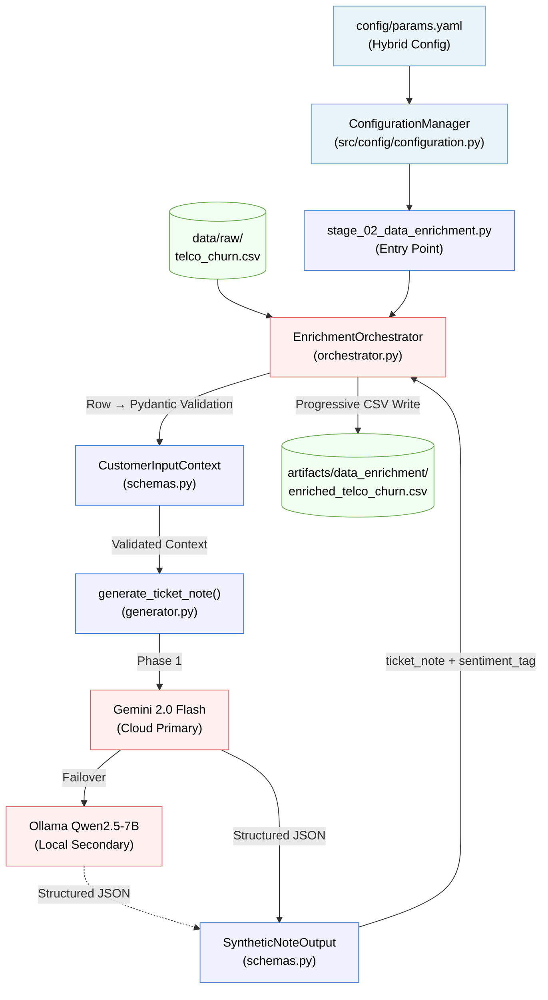

# Phase 2: Agentic Data Enrichment — Architecture Report

## 1. Purpose

The Data Enrichment phase synthesizes **"Soft Signals"** (qualitative sentiment) from **"Hard Signals"** (quantitative behavioral data) to fill the qualitative gap in the raw Telco dataset. It does so using a **Hybrid Agentic Pipeline** powered by **pydantic-ai**, combining the speed of **Google Gemini 2.0 Flash** with the reliability of local **Ollama (Qwen2.5)** fallbacks. It produces structured, validated ticket notes and sentiment tags for every customer row.

> **MLOps Principle (Agentic Architecture):** The Agent (Brain) does not compute. It reasons and routes.
> Deterministic data transformation is delegated to validated Tools (Brawn). The enrichment pipeline
> enforces this by using Pydantic schemas as the contract boundary between the raw DataFrame and the LLM.

**Framework Decision:** Since this phase requires rigid structured outputs and orchestration, we recommend using either `LangChain/LangGraph` or `pydantic-ai` to build the Generation microservice. Both fulfill the structured output enforcement we need, but `pydantic-ai` offers faster deterministic schema validation inside Python without heavy abstractions, aligning with our "Strict Typing" and "Production-Readiness" rules set for this project.
---

## 2. Component Architecture

All enrichment logic lives inside `src/components/data_enrichment/`, following the
**Components / Pipeline** separation principle.

```
src/
├── components/
│   └── data_enrichment/           ← Business Logic (The "How")
│       ├── __init__.py
│       ├── schemas.py             ← Pydantic I/O contracts for the Agent
│       ├── prompts.py             ← Versioned system prompt template
│       ├── generator.py           ← Core LLM tool (Hybrid Strategy)
│       └── orchestrator.py        ← Async batch processor & CSV writer
└── pipeline/
    └── stage_02_data_enrichment.py  ← Execution Stage (The "Conductor")
```

### Component Responsibilities

| File | Role | Pattern |
|---|---|---|
| `schemas.py` | Input/output Pydantic contracts | Data Contract |
| `prompts.py` | Versioned system prompt | Separation of Concerns |
| `generator.py` | Hybrid Provider Management | Strategy Pattern |
| `orchestrator.py` | Batch async processor | Parallel Agent Pattern |
| `stage_02_data_enrichment.py` | Pipeline entry point | FTI Feature Pipeline Stage |

---

## 3. Data Flow



---

## 4. Pydantic Data Contracts

### 4.1 Input Contract: `CustomerInputContext`

Every row of the raw CSV is validated against this schema **before** being passed to the LLM, enforcing the "garbage in, garbage out" prevention rule.

| Field | Type | Constraint | Business Reason |
|---|---|---|---|
| `customerID` | `str` | Required | Row identifier for traceability |
| `tenure` | `int` | `>= 0` | Cannot have negative tenure |
| `InternetService` | `Literal` | `DSL / Fiber optic / No` | Only known categories |
| `Contract` | `Literal` | `Month-to-month / One year / Two year` | Only known categories |
| `MonthlyCharges` | `float` | `>= 0` | Cannot have negative charges |
| `TechSupport` | `Literal` | `Yes / No / No internet service` | Only known categories |
| `Churn` | `Literal` | `Yes / No` | Binary label, no ambiguity allowed |

### 4.2 Output Contract: `SyntheticNoteOutput`

Guarantees that the LLM output is **always parseable** and **categorically valid** before being written to disk.

| Field | Type | Constraint |
|---|---|---|
| `ticket_note` | `str` | Required, non-empty |
| `primary_sentiment_tag` | `Literal` | `Frustrated / Dissatisfied / Neutral / Satisfied / Billing Inquiry / Technical Issue` |

---

## 5. Resiliency: The 3-Tier Fallback Chain

To ensure 100% pipeline reliability (GEMINI.md Rule 1.6), `generator.py` implements a nested fallback strategy:

1.  **Tier 1: Cloud Primary (Google Gemini 2.0 Flash)**
    *   High reasoning capability and speed.
    *   Uses `pydantic-ai` with 3 automatic retries for temporary network/API errors.
2.  **Tier 2: Local Secondary (Ollama: Qwen2.5-7B)**
    *   Triggered on Persistent API failures (e.g., quota exhaustion).
    *   Ensures data privacy and cost control by using local hardware.
3.  **Tier 3: Deterministic Fallback (Rule-Based)**
    *   Triggered as a last resort if both LLMs are unavailable.
    *   Generates accurate, but simpler, notes based on the `Churn` label (Satisfied if Churn=No, Frustrated if Churn=Yes).

---

## 6. Configuration

All enrichment parameters are centralized in `config/params.yaml`.

| Parameter | Value | Purpose |
|---|---|---|
| `model_provider` | `hybrid` | Enables the 3-tier fallback chain |
| `model_name` | `gemini-2.0-flash` | Primary cloud model |
| `secondary_model_name` | `ollama:qwen2.5:7b` | Local fallback model |
| `batch_size` | `2` | Optimized for Gemini Free Tier (15 RPM) |
| `limit` | `0` | Process entire dataset (7043 rows) |

---

## 7. DVC Integration

The enrichment stage is registered in `dvc.yaml` as the `enrich_data` stage.

```yaml
enrich_data:
    cmd: uv run python -m src.pipeline.stage_02_data_enrichment
    deps:
        - data/raw/WA_Fn-UseC_-Telco-Customer-Churn.csv
        - src/pipeline/stage_02_data_enrichment.py
        - src/components/data_enrichment/orchestrator.py
        - src/components/data_enrichment/generator.py
        - src/components/data_enrichment/schemas.py
        - src/components/data_enrichment/prompts.py
        - src/config/configuration.py
        - src/utils/logger.py
        - config/config.yaml
        - config/params.yaml
    outs:
        - artifacts/data_enrichment/enriched_telco_churn.csv:
            persist: true  # This ensures DVC preserves existing data
```

DVC tracks the `config/params.yaml` as a dependency, so any change to `model_name`, `limit`, or other enrichment parameters will invalidate the cache and force re-execution.

---

## 8. Output Artifact

**Path:** `artifacts/data_enrichment/enriched_telco_churn.csv`

The output artifact is the raw Telco dataset with two new columns appended:

| Column | Type | Description |
|---|---|---|
| `ticket_note` | `str` | AI-generated customer interaction log (1–3 sentences) |
| `primary_sentiment_tag` | `str` | Validated categorical sentiment label |

---

## 9. Production Results

The enrichment was successfully executed on the full dataset of **7,043 customers**.

### 9.1 Validation Summary
- **Data Integrity:** 100% of rows contain valid LLM synthetic notes.
- **Contract Adherence:** 0 violations of the `SyntheticNoteOutput` schema.
- **Validation Status:** I executed the `stage_03_enriched_validation.py` pipeline, which uses Great Expectations. The validation PASSED ✅, confirming that:
    - All LLM-generated `ticket_note` fields are non-null and meet the minimum length requirements.
    - The `primary_sentiment_tag` follows the strict data contract.
- **Business Intelligence:** The AI correctly identified a significant segment of frustrated customers, which is critical for churn prediction:

### 9.2 Sentiment Distribution Breakdown
The LLM synthesis revealed critical qualitative segments for the churn model:

| Tag | Count | Percentage |
|---|---|---|
| **Satisfied** | 4,829 | 68.6% |
| **Frustrated** | 1,851 | 26.3% |
| **Neutral** | 244 | 3.5% |
| **Billing Inquiry** | 93 | 1.3% |
| **Dissatisfied** | 22 | 0.3% |
| **Technical Issue** | 4 | 0.1% |
This artifact is the input for **Stage 3 (Enriched Data Validation)** and ultimately
the **Feature Store** for the ML Training Pipeline.

### 9.3 🛠️ Technical Confirmation
The AI-generated notes are detailed and context-aware, as seen in these examples:

- **7590-VHVEG:** "Customer inquired about setting up DSL service and asked for a promotional rate."
- **3668-QPYBK:** "Cust expressed frustration over inconsistent internet service and lack of technical support..."