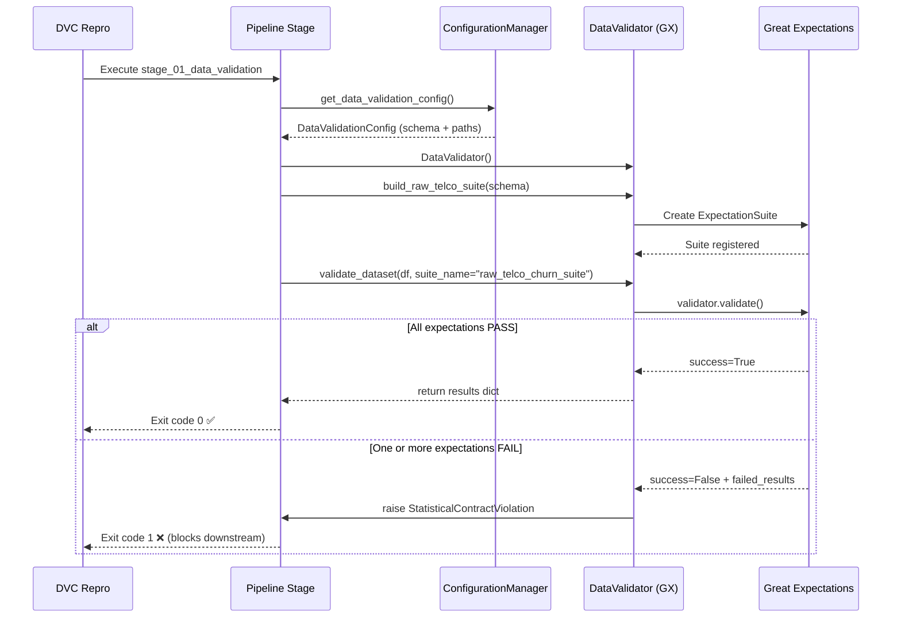

# Data Validation (GX) — Architecture Report

## 1. Purpose

The Data Validation phase acts as a **quality gate** in the FTI Feature Pipeline.
It prevents "garbage in, garbage out" by blocking data that fails statistical or
schema contracts from reaching the training or inference stages.

> **MLOps Principle (The Inspector):** The `DataValidator` component does not mutate data
> — it evaluates it. Its sole responsibility is to validate a DataFrame against a predefined
> Expectation Suite and `raise` a loud, typed exception if any contract is violated.

---

## 2. Architecture: Two-Stage Validation

The system enforces data quality at **two distinct checkpoints** in the Feature Pipeline.

```
Feature Pipeline
│
├── Stage 1: validate_raw
│   └── src/pipeline/stage_01_data_validation.py
│       └── src/components/data_validation.py (DataValidator)
│           └── Suite: raw_telco_churn_suite
│               ├── column presence (from schema.yaml)
│               ├── tenure range [0, 120]
│               ├── InternetService values {DSL, Fiber optic, No}
│               ├── Contract values {Month-to-month, One year, Two year}
│               └── Churn values {Yes, No}
│
├── Stage 2: enrich_data              ← (Phase 2 Agent)
│
└── Stage 3: validate_enriched
    └── src/pipeline/stage_03_enriched_validation.py
        └── src/components/data_validation.py (DataValidator)
            └── Suite: enriched_telco_churn_suite
                ├── column presence (from schema.yaml ENRICHED_COLUMNS)
                ├── ticket_note not null (mostly >= 0.95)
                ├── ticket_note length >= 10 chars (mostly >= 0.90)
                └── primary_sentiment_tag in valid set (mostly >= 0.95)
```

---

## 3. Component: `DataValidator`

**File:** `src/components/data_validation.py`

The `DataValidator` class wraps the **Great Expectations v1.0+ API** in a clean interface
that pipeline stages can use without knowing the internals of GX.

### 3.1 Design Decisions

| Decision | Rationale |
|---|---|
| **Ephemeral GX Context** | No filesystem GX project required. Works as a standard Python microservice without setup. |
| **Schema-driven suites** | Suite expectations are parameterized by `schema.yaml`, making schema drift detectable without code changes. |
| **Loud failure** | On validation failure, raises `StatisticalContractViolation` (a domain-specific exception), not a generic `Exception`. |
| **`mostly` threshold** | LLM-generated columns use a `mostly=0.95` threshold to tolerate a small percentage of LLM fallbacks or `None` values. |

### 3.2 Expectation Suite Summary

#### `raw_telco_churn_suite`

| Expectation | Column | Constraint |
|---|---|---|
| `ExpectTableColumnsToMatchSet` | (table) | All 21 COLUMNS from `schema.yaml` must be present |
| `ExpectColumnValuesToBeBetween` | `tenure` | `[0, 120]` |
| `ExpectColumnValuesToBeInSet` | `InternetService` | `{DSL, Fiber optic, No}` |
| `ExpectColumnValuesToBeInSet` | `Contract` | `{Month-to-month, One year, Two year}` |
| `ExpectColumnValuesToBeInSet` | `Churn` | `{Yes, No}` |

#### `enriched_telco_churn_suite`

| Expectation | Column | Constraint | Threshold |
|---|---|---|---|
| `ExpectTableColumnsToMatchSet` | (table) | All ENRICHED_COLUMNS from `schema.yaml` | exact=False |
| `ExpectColumnValuesToNotBeNull` | `ticket_note` | Not null | mostly=0.95 |
| `ExpectColumnValueLengthsToBeBetween` | `ticket_note` | Length >= 10 | mostly=0.90 |
| `ExpectColumnValuesToBeInSet` | `primary_sentiment_tag` | 5 valid sentiment categories | mostly=0.95 |

---

## 4. Schema Integration (`schema.yaml`)

The validation suites are **parameterized** by `config/schema.yaml`, which is the authoritative
schema definition for both the raw and enriched datasets.

```yaml
COLUMNS:
  customerID: category
  gender: category
  SeniorCitizen: int64
  # ... (21 raw columns)

ENRICHED_COLUMNS:
  # Inherits all COLUMNS +
  ticket_note: object
  primary_sentiment_tag: category
```

The `ConfigurationManager` loads this schema and passes it into the `DataValidationConfig`
and `DataEnrichmentConfig` entities, which are then consumed by the pipeline stages.

---

## 5. Exception Architecture

The `StatisticalContractViolation` exception is a **domain-specific, loud failure** mechanism.
It satisfies the **Rule 2.2 (Custom Exception Handling)** standard for Agentic Systems.

```python
raise StatisticalContractViolation(
    message="Dataset telco_raw failed 3 expectations.",
    context=DataQualityContext(
        dataset_id="telco_raw",
        pipeline_stage="ingestion",
        expectation="All expectations in raw_telco_churn_suite must pass.",
        actual_value=["ExpectColumnValuesToBeInSet on 'Churn'", ...],
        suggested_action="Review data quality and fix issues or adjust expectations.",
    ),
)
```

| Property | Purpose |
|---|---|
| `to_agent_context()` | Serializes the exception into a string an Agent can reason about |
| `DataQualityContext` | Rich Pydantic model with full context: column, stage, suggested action |
| `failed_logs` | Top-5 failed expectations for fast triage |

---

## 6. DVC Integration

Both validation stages are tracked in `dvc.yaml`:

```yaml
validate_raw:
  cmd: uv run python -m src.pipeline.stage_01_data_validation
  deps:
    - data/raw/WA_Fn-UseC_-Telco-Customer-Churn.csv
    - src/components/data_validation.py
    - config/schema.yaml
  # No outs — pure quality gate

validate_enriched:
  cmd: uv run python -m src.pipeline.stage_03_enriched_validation
  deps:
    - artifacts/data_enrichment/enriched_telco_churn.csv
    - src/components/data_validation.py
    - config/schema.yaml
  # No outs — pure quality gate
```

> **Design Note:** Validation stages produce **no DVC-tracked output artifacts**.
> They are purely gate stages. If they fail, `dvc repro` exits with code `1`,
> blocking downstream stages from running.

---

## 7. Validation Flow Diagram


