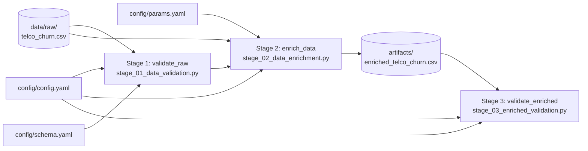
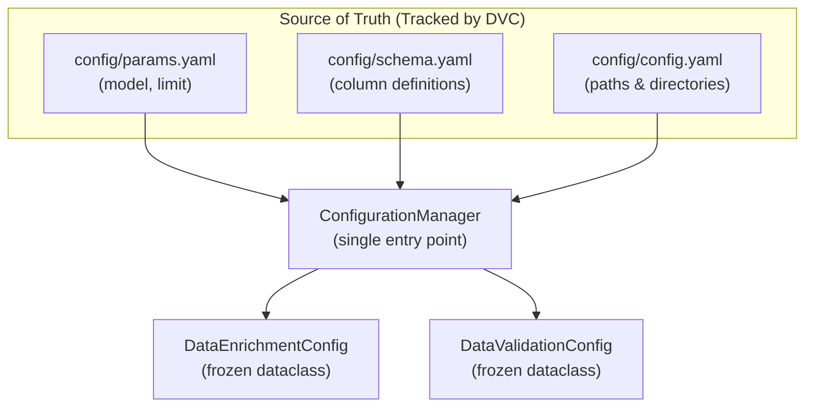

# DVC Pipeline Architecture — Architecture Report

## 1. Purpose

**DVC (Data Version Control)** is the backbone of the project's reproducibility and lineage tracking.
It manages the full DAG (Directed Acyclic Graph) of pipeline stages, ensuring that every run of
`dvc repro` produces **bit-for-bit identical outputs** given the same inputs.

> **MLOps Principle (Rule 2.4 — MLOps Integrity Check):** All pipeline stages must support
> data versioning via DVC. Any change to code, configuration, or data **automatically invalidates**
> the affected stage and all downstream stages.

---

## 2. Current Pipeline DAG

Three stages are currently registered in `dvc.yaml`, representing the Feature Pipeline (the "F" in FTI).



---

## 3. Stage Specifications

### Stage 1: `validate_raw`

**Command:** `uv run python -m src.pipeline.stage_01_data_validation`

| Property | Value |
|---|---|
| **Purpose** | Validates the raw Telco CSV against GX suite before enrichment |
| **Inputs** | Raw CSV + schema.yaml + config.yaml + source scripts |
| **Output** | None (Pure quality gate — blocks pipeline on failure) |
| **Cache** | Invalidated if raw data, schema, or validation code changes |

### Stage 2: `enrich_data`

**Command:** `uv run python -m src.pipeline.stage_02_data_enrichment`

| Property | Value |
|---|---|
| **Purpose** | Runs the Agentic LLM enrichment pipeline to add ticket notes |
| **Inputs** | Raw CSV + params.yaml + config.yaml + all enrichment component files |
| **Output** | `artifacts/data_enrichment/enriched_telco_churn.csv` |
| **Cache** | Invalidated if any input changes (including `params.yaml` → `model_name`, `limit`) |

> **Reproducibility Note:** Because `params.yaml` is a DVC dependency, changing
> `limit` or `model_name` will force a full re-run. This guarantees that the enriched
> artifact always reflects the exact parameters used to create it.

### Stage 3: `validate_enriched`

**Command:** `uv run python -m src.pipeline.stage_03_enriched_validation`

| Property | Value |
|---|---|
| **Purpose** | Validates the LLM-generated columns before promoting to Feature Store |
| **Inputs** | Enriched CSV + schema.yaml + config.yaml + validation scripts |
| **Output** | None (Pure quality gate) |
| **Cache** | Invalidated if enriched artifact or validation code changes |

---

## 4. Full `dvc.yaml` Definition

```yaml
stages:
  validate_raw:
    cmd: uv run python -m src.pipeline.stage_01_data_validation
    deps:
      - data/raw/WA_Fn-UseC_-Telco-Customer-Churn.csv
      - src/pipeline/stage_01_data_validation.py
      - src/components/data_validation.py
      - src/config/configuration.py
      - src/utils/logger.py
      - src/utils/exceptions.py
      - config/config.yaml
      - config/schema.yaml

  enrich_data:
    cmd: uv run python -m src.pipeline.stage_02_data_enrichment
    deps:
      - data/raw/WA_Fn-UseC_-Telco-Customer-Churn.csv
      - src/pipeline/stage_02_data_enrichment.py
      - src/components/data_enrichment/orchestrator.py
      - src/components/data_enrichment/generator.py
      - src/components/data_enrichment/schemas.py
      - src/components/data_enrichment/prompts.py
      - src/config/configuration.py
      - src/utils/logger.py
      - config/config.yaml
      - config/params.yaml
    outs:
      - artifacts/data_enrichment/enriched_telco_churn.csv

  validate_enriched:
    cmd: uv run python -m src.pipeline.stage_03_enriched_validation
    deps:
      - artifacts/data_enrichment/enriched_telco_churn.csv
      - src/pipeline/stage_03_enriched_validation.py
      - src/components/data_validation.py
      - src/config/configuration.py
      - src/utils/logger.py
      - config/config.yaml
```

---

## 5. Configuration Hierarchy



**Configuration precedence is strict:**
1. `config/params.yaml` → tunable hyperparameters (LLM model, limits)
2. `config/schema.yaml` → data contracts (column presence, types)
3. `config/config.yaml` → artifact paths and directories
4. Hardcoded defaults in `ConfigurationManager` → last resort fallback

**Environment variables are NOT used** to override DVC-tracked parameters, ensuring
that every `dvc repro` call is fully deterministic and reproducible.

---

## 6. Reproducing the Pipeline

```bash
# Run all stages (uses DVC cache if unchanged)
uv run dvc repro

# Force re-run of all stages (ignoring cache)
uv run dvc repro --force

# Run a specific stage only
uv run dvc repro enrich_data

# Inspect the pipeline DAG
uv run dvc dag
```

---

## 7. Planned Future Stages

The following stages will be added as the project progresses through the FTI pattern:

| Stage Name | Phase | Description |
|---|---|---|
| `feature_engineering` | Training | NLP vectorization of ticket notes, SMOTE, scaling |
| `train_model` | Training | XGBoost/LightGBM with MLflow tracking |
| `evaluate_model` | Training | Champion/challenger comparison gate |
| `serve_model` | Inference | FastAPI deployment trigger |
