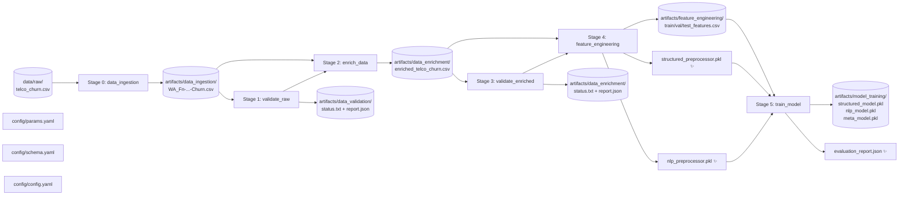
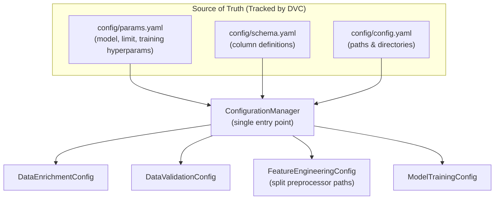

# DVC Pipeline Architecture — Architecture Report

## 1. Purpose

**DVC (Data Version Control)** is the backbone of the project's reproducibility and lineage tracking. It manages the full DAG (Directed Acyclic Graph) of pipeline stages, ensuring that every run of `dvc repro` produces **bit-for-bit identical outputs** given the same inputs.

> **MLOps Principle (Rule 2.4 — MLOps Integrity Check):** All pipeline stages must support data versioning via DVC. Any change to code, configuration, or data **automatically invalidates** the affected stage and all downstream stages.

---

## 2. Current Pipeline DAG (6 Stages — FTI Feature + Training Pipelines)

The pipeline now spans two FTI layers: the complete Feature Pipeline (Stages 0–4) and
the Training Pipeline (Stage 5). The Inference Pipeline (Stage 6+) is planned for Phase 6.



---

## 3. Stage Specifications

### Stage 0: `data_ingestion`

**Command:** `uv run python -m src.pipeline.stage_00_data_ingestion`

| Property | Value |
|---|---|
| **Purpose** | Fetches/copies the raw data into a DVC-tracked artifact |
| **Inputs** | Raw CSV + `config.yaml` + source scripts |
| **Output** | `artifacts/data_ingestion/WA_Fn-...-Churn.csv` |

### Stage 1: `validate_raw`

**Command:** `uv run python -m src.pipeline.stage_01_data_validation`

| Property | Value |
|---|---|
| **Purpose** | Validates raw Telco CSV against GX suite before enrichment |
| **Inputs** | Ingested CSV + `schema.yaml` + `config.yaml` |
| **Output** | `artifacts/data_validation/status.txt`, `validation_report.json` |

### Stage 2: `enrich_data`

**Command:** `uv run python -m src.pipeline.stage_02_data_enrichment`

| Property | Value |
|---|---|
| **Purpose** | Agentic LLM enrichment — generates leakage-free ticket notes |
| **Inputs** | Ingested CSV + `params.yaml` + all enrichment component files |
| **Output** | `artifacts/data_enrichment/enriched_telco_churn.csv` |
| **Cache** | Invalidated by changes to `schemas.py`, `prompts.py`, `generator.py`, `params.yaml` |

> **C1 Note:** `schemas.py` and `prompts.py` are declared as DVC dependencies. The C1
> leakage fix (Churn removal + prompt rewrite) automatically invalidated the cache and
> forced a full re-run, which is the intended behavior. The enriched artifact now reflects
> the leakage-free v2 generation.

### Stage 3: `validate_enriched`

**Command:** `uv run python -m src.pipeline.stage_03_enriched_validation`

| Property | Value |
|---|---|
| **Purpose** | Validates LLM-generated columns before promoting to Feature Store |
| **Inputs** | Enriched CSV + validation scripts + `config.yaml` |
| **Output** | `artifacts/data_enrichment/status.txt`, `validation_report.json` |

> **C1 Note:** The GX expectation suite (`build_enriched_telco_suite`) was updated to
> include `"Dissatisfied"` in the `primary_sentiment_tag` value set. The leakage-free
> prompt now produces this tag (19.8% of rows), which was absent from the original suite.

### Stage 4: `feature_engineering` (Modified)

**Command:** `uv run python -m src.pipeline.stage_04_feature_engineering`

| Property | Value |
|---|---|
| **Purpose** | Transforms validated data into two independent ML-ready feature sets |
| **Inputs** | Enriched CSV + `params.yaml` + feature engineering scripts |
| **Output** | `train/val/test_features.csv`, `structured_preprocessor.pkl`, `nlp_preprocessor.pkl` |

> **Enhancement:** The original unified `preprocessor.pkl` has been split into two
> independently serialized artifacts to support the Late Fusion training architecture
> (Phase 5) and the Embedding Microservice (Phase 6). `primary_sentiment_tag` is excluded
> from both preprocessors (Decision A2 — near-deterministic target proxy).

### Stage 5: `train_model` (New — Phase 5)

**Command:** `uv run python -m src.pipeline.stage_05_model_training`

| Property | Value |
|---|---|
| **Purpose** | Late Fusion stacking: two XGBoost base models + Logistic Regression meta-learner |
| **Inputs** | Train/val/test CSVs + both preprocessors + `params.yaml` + training scripts |
| **Output** | `structured_model.pkl`, `nlp_model.pkl`, `meta_model.pkl`, `evaluation_report.json` |
| **MLflow** | Three tracked runs: `structured_baseline`, `nlp_baseline`, `late_fusion_stacked` |

---

## 4. Full `dvc.yaml` Definition

```yaml
stages:
  data_ingestion:
    cmd: uv run python -m src.pipeline.stage_00_data_ingestion
    deps:
      - config/config.yaml
      - src/pipeline/stage_00_data_ingestion.py
      - src/components/data_ingestion.py
      - data/raw/WA_Fn-UseC_-Telco-Customer-Churn.csv
    outs:
      - artifacts/data_ingestion/WA_Fn-UseC_-Telco-Customer-Churn.csv

  validate_raw:
    cmd: uv run python -m src.pipeline.stage_01_data_validation
    deps:
      - artifacts/data_ingestion/WA_Fn-UseC_-Telco-Customer-Churn.csv
      - src/pipeline/stage_01_data_validation.py
      - src/components/data_validation.py
      - src/config/configuration.py
      - src/utils/logger.py
      - src/utils/exceptions.py
      - config/config.yaml
      - config/schema.yaml
    outs:
      - artifacts/data_validation/status.txt
      - artifacts/data_validation/validation_report.json

  enrich_data:
    cmd: uv run python -m src.pipeline.stage_02_data_enrichment
    deps:
      - artifacts/data_ingestion/WA_Fn-UseC_-Telco-Customer-Churn.csv
      - src/pipeline/stage_02_data_enrichment.py
      - src/components/data_enrichment/orchestrator.py
      - src/components/data_enrichment/generator.py
      - src/components/data_enrichment/schemas.py
      - src/components/data_enrichment/prompts.py
      - src/config/configuration.py
      - src/utils/logger.py
      - config/config.yaml
      - config/params.yaml
    outs:
      - artifacts/data_enrichment/enriched_telco_churn.csv:
          persist: true

  validate_enriched:
    cmd: uv run python -m src.pipeline.stage_03_enriched_validation
    deps:
      - artifacts/data_enrichment/enriched_telco_churn.csv
      - src/pipeline/stage_03_enriched_validation.py
      - src/components/data_validation.py
      - src/config/configuration.py
      - src/utils/logger.py
      - config/config.yaml
    outs:
      - artifacts/data_enrichment/status.txt
      - artifacts/data_enrichment/validation_report.json

  feature_engineering:
    cmd: uv run python -m src.pipeline.stage_04_feature_engineering
    deps:
      - artifacts/data_enrichment/enriched_telco_churn.csv
      - src/pipeline/stage_04_feature_engineering.py
      - src/components/feature_engineering.py
      - src/utils/feature_utils.py
      - src/config/configuration.py
      - src/utils/logger.py
      - config/config.yaml
      - config/params.yaml
    outs:
      - artifacts/feature_engineering/train_features.csv
      - artifacts/feature_engineering/test_features.csv
      - artifacts/feature_engineering/val_features.csv
      - artifacts/feature_engineering/structured_preprocessor.pkl
      - artifacts/feature_engineering/nlp_preprocessor.pkl

  train_model:
    cmd: uv run python -m src.pipeline.stage_05_model_training
    deps:
      - artifacts/feature_engineering/train_features.csv
      - artifacts/feature_engineering/val_features.csv
      - artifacts/feature_engineering/test_features.csv
      - artifacts/feature_engineering/structured_preprocessor.pkl
      - artifacts/feature_engineering/nlp_preprocessor.pkl
      - src/pipeline/stage_05_model_training.py
      - src/components/model_training/trainer.py
      - src/components/model_training/evaluator.py
      - src/config/configuration.py
      - src/utils/logger.py
      - config/config.yaml
      - config/params.yaml
    outs:
      - artifacts/model_training/structured_model.pkl
      - artifacts/model_training/nlp_model.pkl
      - artifacts/model_training/meta_model.pkl
      - artifacts/model_training/evaluation_report.json
```

---

## 5. Configuration Hierarchy



---

## 6. Reproducing the Pipeline

```bash
# Run all stages (uses DVC cache if unchanged)
uv run dvc repro

# Force re-run of all stages (ignoring cache)
uv run dvc repro --force

# Run a specific stage
uv run dvc repro train_model

# Inspect the pipeline DAG
uv run dvc dag

# View MLflow results after training
uv run mlflow ui --backend-store-uri file:./mlruns
```

---

## 7. Future Stages

| Stage Name | Phase | Description |
|---|---|---|
| `serve_model` | Phase 6 | FastAPI Embedding Microservice + Prediction API deployment trigger |
| `evaluate_drift` | Phase 9 | Data drift detection on inference payloads vs. training distribution |