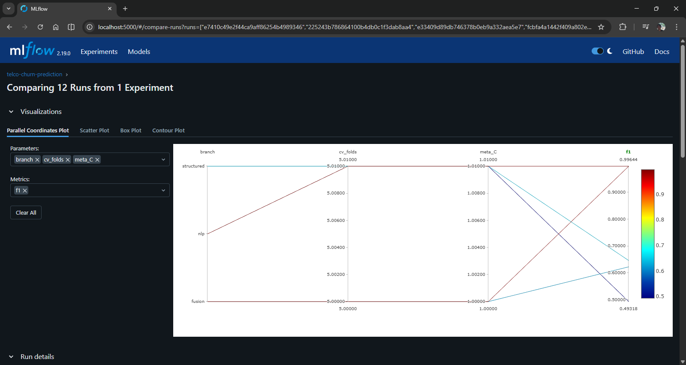

# Phase 7B: Gradio UI — Interactive Dashboard Architecture Report

## 1. Executive Summary

This document details the architecture, containerization strategy, and implementation
decisions for **Phase 7B** of the Telecom Customer Churn Prediction project. Phase 7B
delivers the **fifth and final service** in the Docker Compose stack: a modular Gradio
dashboard that surfaces the Late Fusion inference system to non-engineering stakeholders.

The phase introduces three production patterns that distinguish this dashboard from a
notebook-style prototype: a **module-per-page UI decomposition** (Rule 1.8: Separation
of Concerns), a **read-only artifact mount strategy** that ensures the UI never modifies
model artifacts, and a **`depends_on: condition: service_healthy` startup ordering
contract** that guarantees the dashboard only accepts traffic after the Prediction API
has completed its own warm-up and health registration.

> [!IMPORTANT]
> The Gradio UI is a **consumer-only** layer. It does not train models, persist data,
> or call MLflow directly. All inference is delegated to the `prediction-api`
> microservice via HTTP. SHAP explanations are computed locally using read-only
> mounts of the artifacts produced by the Training Pipeline.

---

## 2. System Topology — Phase 7B (Five Services)

```
┌─────────────────────────────────────────────────────────────────────────┐
│  Docker Compose — bridge network: churn-net                              │
│                                                                          │
│  ┌──────────────────┐    ┌──────────────────┐    ┌──────────────────┐   │
│  │ embedding-service│    │  prediction-api  │    │  mlflow-server   │   │
│  │  Port:8001        │◄───│  Port:8000        │    │  Port:5000       │   │
│  │  nlp_preprocessor│    │  4 model artifacts│    │  mlruns/ (bind)  │   │
│  │  SentenceTransf. │    │  circuit breaker  │    │                  │   │
│  └──────────────────┘    └────────┬─────────┘    └──────────────────┘   │
│                                   │ HTTP (depends_on: service_healthy)   │
│                          ┌────────▼─────────┐                           │
│                          │   gradio-ui       │                           │
│                          │   Port:7860       │  ← Phase 7B (this doc)   │
│                          │   src/ui/         │                           │
│                          │   SHAP (local)    │                           │
│                          └──────────────────┘                            │
│                                                                          │
│  Startup order enforced via depends_on + condition: service_healthy:     │
│  embedding-service ──► prediction-api ──► gradio-ui                     │
└─────────────────────────────────────────────────────────────────────────┘
```

The `gradio-ui` is the only **user-facing** service. It has no write path to any
shared artifact store, MLflow, or database. Read-only bind mounts prevent artifact
corruption even under application bugs.

---

## 3. Why Docker for the Interactive Dashboard

### 3.1 The Core Argument: Dependency Isolation

The Gradio dashboard requires a precise intersection of heavy ML libraries:
`gradio`, `shap`, `matplotlib`, `xgboost`, `scikit-learn`, and `sentence-transformers`.
Installing these globally on a host machine creates immediate version conflicts with
the `prediction-api`'s own Python environment (which also depends on `xgboost` and
`scikit-learn`, but potentially at different minor versions).

Docker provides **hermetic isolation by construction**. Each service carries its own
virtual environment baked into the image layer cache — no system-level dependency
management is required, and no service can corrupt the runtime of another.

### 3.2 Service Mesh Membership

Without containerization, the `gradio-ui` cannot reach `prediction-api` via Docker's
internal DNS (`http://prediction-api:8000`). The bridge network `churn-net` provides
a **stable, private hostname** for each service that is both secure (not exposed to
the host unless a port is published) and configuration-free (no IP address management).

The `PREDICTION_API_URL` environment variable is injected at Compose startup:

```yaml
environment:
  PREDICTION_API_URL: http://prediction-api:8000  # resolved by Docker DNS
```

This means the *same Docker image* can be repointed to a staging or production
`prediction-api` by changing a single environment variable — no code change required.

### 3.3 Startup Ordering as a First-Class Contract

A plain Python `gradio.launch()` process, started before the Prediction API is ready,
would crash on the first user interaction. Docker Compose's `depends_on: condition:
service_healthy` makes the readiness gate **infrastructure-level** rather than
application-level:

```yaml
# docker-compose.yaml
gradio-ui:
  depends_on:
    prediction-api:
      condition: service_healthy
```

The `prediction-api` itself declares a `HEALTHCHECK` that only passes after all four
model artifacts have been loaded into memory. The startup chain is therefore:

```
embedding-service warmup (13s)
       │
       ├─ /v1/health → 200
       │
prediction-api load (artifact deserialization)
       │
       ├─ /v1/health → 200
       │
gradio-ui starts ← only after prediction-api is 200
       │
       └─ port 7860 open to host
```

This ordering guarantee cannot be replicated with plain `sleep` timers or retry loops
in application code, both of which are fragile under load.

### 3.4 Reproducibility and Portability

The multi-stage Dockerfile bakes a pinned `uv==0.6.14` installation into the builder
stage and produces a lean runtime image from `python:3.11-slim`. Any engineer with
Docker installed can reproduce the exact Gradio environment in minutes:

```bash
docker compose up --build gradio-ui
```

No Python virtual environment setup, no `pip install` debugging, no "works on my
machine" failures.

### 3.5 Security: Non-Root User Enforcement

Rule 6.1 (Security-by-Default) mandates that containers never run as root. The
Dockerfile creates a dedicated system user before the `COPY` stage:

```dockerfile
RUN addgroup --system appgroup && \
    adduser --system --ingroup appgroup --no-create-home appuser
```

All bind-mounted volumes (`artifacts/`, `mlruns/`) are read-only (`:ro` flag),
preventing any Gradio-level bug from writing to the model artifact store or MLflow
run history.

---

## 4. Modular UI Architecture (Rule 1.8 — Separation of Concerns)

A monolithic `app.py` containing all form logic, HTTP calls, and SHAP computation
would fail the "Production-Readiness" standard. Phase 7B decomposes the UI into
four concerns: **data loading**, **computation components**, **page composition**,
and **application assembly**.

### 4.1 Module Structure

```
src/ui/
├── __init__.py
├── app.py                         ← Entry point: assembles tabs, applies theme
├── data_loaders/
│   ├── __init__.py
│   └── api_client.py              ← HTTP boundary: predict_single, predict_batch, check_health
├── components/
│   ├── __init__.py
│   └── shap_chart.py              ← SHAP waterfall chart generator (local computation)
└── pages/
    ├── __init__.py
    ├── single_predict.py          ← Single customer prediction form (20 inputs, SHAP tab)
    ├── batch_predict.py           ← CSV upload → batch scoring → results DataFrame
    └── run_comparison.py          ← Evaluation report parser → Champion vs Challenger table
```

### 4.2 Layer Ownership

| Layer | Module | Owns | Never Touches |
|---|---|---|---|
| **Assembly** | `app.py` | Theme, `gr.Blocks`, tab registration | HTTP calls, model artifacts, pandas |
| **API Boundary** | `api_client.py` | `httpx` requests, error wrapping | Gradio, sklearn, SHAP |
| **Computation** | `shap_chart.py` | `joblib.load()`, `TreeExplainer`, `watefall` | Gradio, `httpx`, file upload |
| **Page Composition** | `pages/*.py` | Gradio component layout, event binding | SHAP internals, HTTP session |

This boundary is enforced by imports: `api_client.py` imports only `httpx`, `os`,
`logging`, and `typing`. It has zero knowledge of Gradio, sklearn, or SHAP.

---

## 5. Component Deep Dives

### 5.1 `data_loaders/api_client.py` — HTTP Boundary

The API client wraps all HTTP operations into three deterministic functions with
typed inputs and outputs. It never raises exceptions to the caller — all `httpx`
failures are caught, logged, and returned as `{"error": str(e)}` dictionaries:

```python
def predict_single(customer_data: dict[str, Any]) -> dict[str, Any]:
    try:
        response = httpx.post(f"{API_URL}/v1/predict", json=customer_data, timeout=10.0)
        response.raise_for_status()
        return response.json()
    except httpx.HTTPError as e:
        logger.error(f"API Error in predict_single: {e}")
        return {"error": str(e)}
```

This design means Gradio event handlers only need to check for the presence of an
`"error"` key rather than catching exceptions — keeping page logic clean.

**Configuration:** `PREDICTION_API_URL` is read once at module import time via
`os.environ.get(...)`, defaulting to `http://localhost:8000` for local development
outside Docker.

### 5.2 `components/shap_chart.py` — Local SHAP Explainability

SHAP explanations are computed **locally inside the Gradio container**, not via the
Prediction API. This is a deliberate architectural choice:

- The Prediction API is a performance-critical service. Adding SHAP computation
  (which can take 300–800ms per customer including `TreeExplainer` instantiation)
  would degrade inference latency for all callers, not just the dashboard.
- SHAP is a **diagnostic tool for human understanding**, not an inference artifact.
  It belongs in the UI layer.

The module uses lazy loading and module-level caching to avoid reloading the
1.5–2 MB artifact on every prediction:

```python
_structured_preprocessor = None  # cached after first load
_structured_model = None

def _load_artifacts() -> None:
    global _structured_preprocessor, _structured_model
    if _structured_preprocessor is None:   # only load once per container lifetime
        ...
```

The SHAP waterfall chart is returned as a `matplotlib.figure.Figure` object, which
Gradio's `gr.Plot()` component accepts natively.

**Artifact access:** The two required artifacts are mounted read-only:

```yaml
volumes:
  - ./artifacts/model_training:/app/artifacts/model_training:ro
  - ./artifacts/feature_engineering:/app/artifacts/feature_engineering:ro
```

### 5.3 `pages/single_predict.py` — Single Prediction Form

The single prediction page collects **20 input fields** (19 structured features
from the `CustomerFeatureRequest` schema + 1 `ticket_note` for the NLP branch).
The form is organized into three columns mirroring the conceptual partitions
of the raw Telco dataset:

| Column | Fields | Schema Section |
|---|---|---|
| Demographics & Account | `customerID`, `gender`, `SeniorCitizen`, `Partner`, `Dependents`, `tenure` | Customer identity |
| Service Portfolio | `PhoneService`, `MultipleLines`, `InternetService`, all add-ons | Product usage |
| Billing & NLP | `Contract`, `PaperlessBilling`, `PaymentMethod`, `MonthlyCharges`, `TotalCharges`, `ticket_note` | Revenue + CSAT signal |

The `_handle_predict` inner function orchestrates two sequential operations:
1. `predict_single(payload)` — delegates to the API client (HTTP call)
2. `get_shap_plot(payload)` — runs SHAP locally in parallel with result display

**Key schema handling:** `TotalCharges` is collected as a `gr.Textbox` (not a
number input) to preserve the `str | None` contract from `CustomerFeatureRequest`,
matching the Anti-Skew Mandate (Rule 2.9). Blank inputs are converted to `None`
before sending to the API.

### 5.4 `pages/batch_predict.py` — CSV Batch Scoring

Users upload a CSV file that is read into a `pandas.DataFrame`, converted to a
list of records, and sent to `POST /v1/predict/batch`. The response is parsed into
a five-column results table:

| Column | Source |
|---|---|
| Customer ID | `ChurnPredictionResponse.customerID` |
| Churn Prediction | `churn_prediction` → "Yes"/"No" |
| Probability | `churn_probability` (4 decimal places) |
| Structured Branch | `p_structured` |
| NLP Branch | `p_nlp` |

An NLP status badge (`✅ NLP Active` / `⚠️ NLP Fallback Used`) reflects the
`nlp_branch_available` flag returned by the batch endpoint, giving operators
visibility into circuit breaker state during batch runs.

### 5.5 `pages/run_comparison.py` — Experiment Comparison Panel

This page reads `artifacts/model_training/evaluation_report.json` — the structured
comparison artifact produced at the end of the Training Pipeline — and renders
a Champion vs. Challenger comparison table:

| Model Architecture | Recall | Precision | F1 Score | ROC AUC | Recall Lift | F1 Lift |
|---|---|---|---|---|---|---|
| Structured Baseline | ... | ... | ... | ... | — | — |
| NLP Baseline | ... | ... | ... | ... | — | — |
| Late Fusion Stacked | ... | ... | ... | ... | +X.XXXX | +X.XXXX |

The "Lift" columns are only populated for `late_fusion_stacked`, making the
business value uplift immediately visible without requiring users to access MLflow.

A direct deep link to the `mlflow-server` container (`http://localhost:5000`)
is provided for engineers who need the full run history and artifact lineage.



---

## 6. Dockerfile — Multi-Stage Build

```
Stage 1 (builder): python:3.11-slim
  └─ uv==0.6.14 (pinned)
  └─ uv pip install: gradio, httpx, pandas, numpy, shap, joblib, matplotlib,
                     xgboost, scikit-learn, seaborn, python-dotenv,
                     python-box, pyyaml, rich

Stage 2 (runtime): python:3.11-slim
  └─ Non-root user: appuser:appgroup
  └─ COPY --from=builder /app/.venv
  └─ COPY src/ui/, src/config/, src/entity/, src/utils/,
         src/__init__.py, src/constants/, config/
  └─ ENV: PYTHONPATH=/app, PREDICTION_API_URL, GRADIO_SERVER_*
  └─ EXPOSE 7860
  └─ HEALTHCHECK: httpx.get('http://localhost:7860/')
  └─ CMD: python -m src.ui.app
```

**Why multi-stage?** The builder stage installs build tools (`pip`, `uv`) and
resolves the full dependency graph. The runtime stage copies only the compiled
`.venv`, discarding all build tooling. This produces a smaller image and reduces
the attack surface in production.

**Why `python:3.11-slim` and not `python:3.11-alpine`?** `shap` and `xgboost`
require `glibc` symbols not present in Alpine's musl-libc. `slim` is the correct
baseline for ML libraries.

---

## 7. Docker Compose Service Definition

```yaml
gradio-ui:
  build:
    context: .
    dockerfile: docker/gradio_ui/Dockerfile
  image: telecom-churn/gradio-ui:latest
  container_name: gradio-ui
  ports:
    - "7860:7860"
  volumes:
    - ./artifacts/model_training:/app/artifacts/model_training:ro
    - ./artifacts/feature_engineering:/app/artifacts/feature_engineering:ro
    - ./mlruns:/app/mlruns:ro
  environment:
    PREDICTION_API_URL: http://prediction-api:8000
  depends_on:
    prediction-api:
      condition: service_healthy
  networks:
    - churn-net
  restart: unless-stopped
```

### 7.1 Volume Strategy

| Volume | Mount | Access | Purpose |
|---|---|---|---|
| `artifacts/model_training` | `/app/artifacts/model_training` | `:ro` | `structured_model.pkl` for SHAP; `evaluation_report.json` |
| `artifacts/feature_engineering` | `/app/artifacts/feature_engineering` | `:ro` | `structured_preprocessor.pkl` for SHAP transform |
| `mlruns` | `/app/mlruns` | `:ro` | Reserved for future MLflow client integration |

All three mounts are **read-only**. The `:ro` flag is non-optional — it is a
hard security boundary ensuring that an application bug in the Gradio layer
cannot corrupt training artifacts or MLflow run history.

---

## 8. Enhancing the Application — Roadmap

The current Phase 7B implementation is intentionally scoped to the five confirmed
components. The following enhancements are staged in priority order for future phases.

### 8.1 Real-Time Health Status Banner (High Priority)

**Current state:** The SHAP panel returns `None` silently if artifacts are unavailable.
The NLP badge only shows circuit breaker state post-prediction.

**Enhancement:** Add a persistent top-of-page health banner using `check_health()`
from `api_client.py` on every page load via a Gradio `load` event:

```python
app.load(fn=_refresh_health_status, outputs=[health_banner])
```

The banner would show `✅ All Systems Operational` / `⚠️ NLP Branch Degraded (circuit breaker active)` /
`❌ Prediction API Unreachable`, giving operators instant system awareness.

### 8.2 Confidence Gauge Component (High Priority)

**Enhancement:** Replace the numeric `gr.Number(label="Churn Probability")` output
with a colored gauge: Green (< 0.3), Amber (0.3–0.6), Red (> 0.6). This maps
the model's probability output to an actionable business risk level without
requiring the end-user to interpret decimal probabilities.

Implementation via a custom `matplotlib` figure component or Gradio's `gr.BarPlot`.

### 8.3 CSV Template Download (Medium Priority)

**Enhancement:** Provide a pre-filled, correctly-typed CSV template download button
in the Batch Prediction tab. This eliminates the most common user error: uploading
CSVs with incorrect column names or data types that fail `CustomerFeatureRequest`
validation.

```python
gr.File(value="templates/customer_template.csv", label="Download CSV Template")
```

### 8.4 Async Batch Processing with Progress Bar (Medium Priority)

**Current state:** Large batch CSVs (> 1,000 rows) block the Gradio event loop
during the `httpx.post` call, which has a 30-second timeout.

**Enhancement:** Switch `process_batch` to an `async def` handler with streaming
progress via `gr.Progress()`:

```python
async def process_batch(file_path, progress=gr.Progress()):
    ...
    for i, chunk in enumerate(chunks):
        progress(i / total_chunks, f"Scoring chunk {i+1}/{total_chunks}...")
        results.extend(await predict_batch_async(chunk))
```

This requires adding `httpx.AsyncClient` to `api_client.py`.

### 8.5 LLM Narrative Summary via Agentic Layer (Future Phase)

**Enhancement:** After a single prediction, invoke the Agentic Layer (Phase 8)
to generate a natural-language churn risk narrative. Example output:

> *"This customer has a 70.1% churn probability, driven primarily by their
> Fiber optic service with no add-ons and a month-to-month contract (tenure: 1 month,
> monthly spend: $95.50). The support ticket language also indicates frustration.
> Recommended intervention: Offer a 12-month contract discount."*

This transforms the dashboard from a prediction tool into an **Agentic Decision
Support System** — the core goal of the Agentic Data Science transformation (Rule 1.1).

### 8.6 Authentication Layer (Production Requirement)

**Current state:** Port 7860 is publicly accessible to anyone on the host network.

**Enhancement:** Add Gradio's built-in authentication before production exposure:

```python
app.launch(auth=("admin", os.environ.get("GRADIO_PASSWORD")), ...)
```

For multi-user enterprise deployments, integrate with an OAuth2 provider
(e.g., Okta, Azure AD) via a reverse proxy (nginx + OAuth2-proxy sidecar).

### 8.7 Drift Detection Monitoring Tab (Future Phase)

**Enhancement:** Add a fourth tab that reads feature distributions from the
Feature Store and computes PSI (Population Stability Index) against the training
baseline, making data drift visible to operations teams without requiring MLflow
access.

---

## 9. Operational Runbook

### Quick Start

```bash
# Build and start the full stack
docker compose up --build

# Access the dashboard
open http://localhost:7860

# Check service health
docker compose ps

# Stream Gradio logs only
docker compose logs -f gradio-ui

# Restart Gradio without rebuilding
docker compose restart gradio-ui
```

### When Artifacts Are Not Ready

The SHAP component and Run Comparison tab both depend on DVC pipeline outputs.
If these artifacts do not yet exist, the UI degrades gracefully:

- **SHAP panel:** Returns `None` → `gr.Plot()` shows "No plot available"
- **Run Comparison tab:** Returns a single-row DataFrame with `{"Error": "evaluation_report.json not found"}`

To populate artifacts, run the DVC pipeline first:

```bash
dvc repro
docker compose up --build gradio-ui
```

---

## 10. Acceptance Criteria — Phase 7B

| Check | Expected Result |
|---|---|
| `http://localhost:7860` accessible | Gradio dashboard loads with Soft/Indigo theme |
| Single Prediction — high-risk profile | Returns probability > 0.5, NLP status badge visible |
| Single Prediction — SHAP chart | Waterfall chart renders with feature names |
| Single Prediction — API offline | Error message displayed without crash |
| Batch Prediction — valid CSV | Results table populated, NLP status shown |
| Batch Prediction — missing file | "Please upload a CSV file." status message |
| Run Comparison — report exists | Three-row table with Recall/F1/Lift columns |
| Run Comparison — report missing | Graceful error row, no crash |
| Container startup order | `gradio-ui` only starts after `prediction-api: service_healthy` |
| Non-root user | `docker exec gradio-ui whoami` returns `appuser` |
| Artifact immutability | `docker exec gradio-ui touch /app/artifacts/model_training/test` → Permission denied |

---

## 11. Files Delivered

| File | Type | Purpose |
|---|---|---|
| `src/ui/__init__.py` | Created | Package marker |
| `src/ui/app.py` | Created | Main Gradio Blocks assembler |
| `src/ui/data_loaders/__init__.py` | Created | Package marker |
| `src/ui/data_loaders/api_client.py` | Created | HTTP client for prediction endpoints |
| `src/ui/components/__init__.py` | Created | Package marker |
| `src/ui/components/shap_chart.py` | Created | Local SHAP waterfall chart generator |
| `src/ui/pages/__init__.py` | Created | Package marker |
| `src/ui/pages/single_predict.py` | Created | 20-field single prediction form |
| `src/ui/pages/batch_predict.py` | Created | CSV upload → batch scoring → DataFrame |
| `src/ui/pages/run_comparison.py` | Created | evaluation_report.json → comparison table |
| `docker/gradio_ui/Dockerfile` | Created | Multi-stage build, non-root user |
| `docker-compose.yaml` | Modified | Activated `gradio-ui` service (Phase 7B) |
| `pyproject.toml` | Modified | Added `numba>=0.57.0` constraint for SHAP/Python 3.11 |
| `reports/docs/workflows/phase_07b.md` | Created | Decision H1 log |

---

## 12. Related Documents

| Topic | Document |
|---|---|
| Overall System & FTI Pattern | [architecture.md](architecture.md) |
| Phase 6: Inference Microservices | [inference.md](inference.md) |
| Phase 5: Late Fusion Model | [model_training.md](model_training.md) |
| Phase 4: Feature Engineering | [feature_engineering.md](feature_engineering.md) |
| Phase 7B Decision Log | [phase_07b.md](../workflows/phase_07b.md) |
