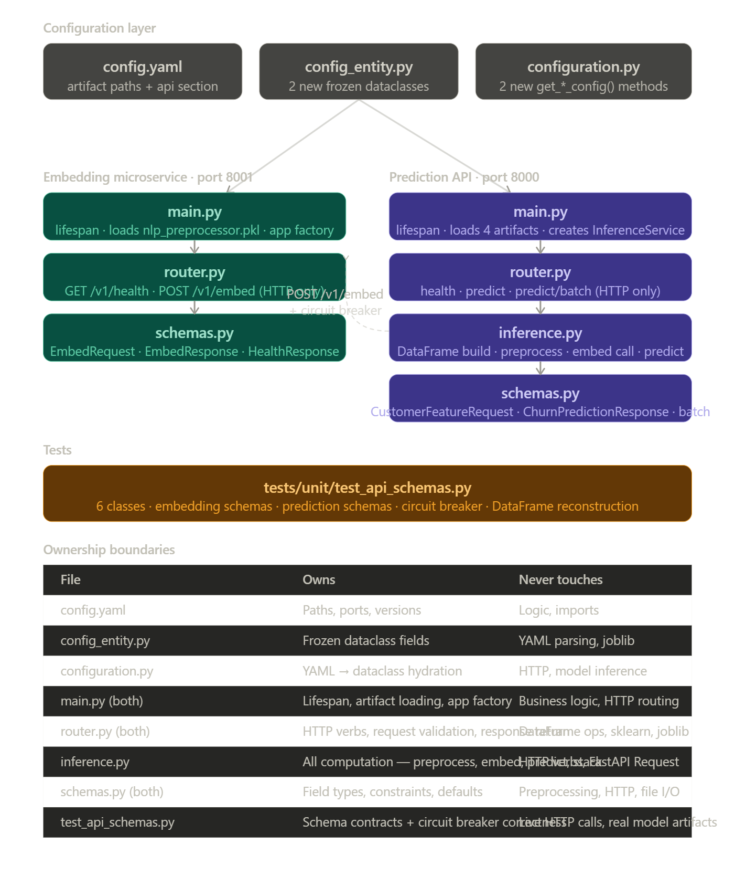

# Phase 6: Inference Pipeline — Microservice Architecture Report

## 1. Executive Summary

This document details the architecture, implementation decisions, and operational
findings for Phase 6 of the Telecom Customer Churn Prediction project. Phase 6
implements the **Inference Pipeline** ("I") of the FTI pattern as two decoupled
FastAPI microservices, enforcing Rule 1.3 (Tools as Microservices) and completing
the path from raw customer data to a live churn risk score.

The phase introduces four production-grade patterns that distinguish this system
from a notebook-to-API promotion: the three-layer service architecture
(config → lifespan → router → inference logic), the inter-service circuit breaker,
the SentenceTransformer warmup protocol, and the `depends_on: condition:
service_healthy` startup ordering contract for Phase 7 Docker Compose.

---

## 2. Service Topology

```
┌─────────────────────────────────────────────────────────────────────┐
│  Runtime (local) / Docker Compose network (Phase 7)                 │
│                                                                     │
│  ┌────────────────────────┐    ┌──────────────────────────────┐    │
│  │  embedding-service     │    │  prediction-api               │    │
│  │  Port: 8001            │    │  Port: 8000                   │    │
│  │                        │    │                               │    │
│  │  Artifact loaded:      │◄───│  Artifacts loaded:            │    │
│  │  nlp_preprocessor.pkl  │    │  structured_preprocessor.pkl  │    │
│  │                        │    │  structured_model.pkl         │    │
│  │  POST /v1/embed        │    │  nlp_model.pkl                │    │
│  │  GET  /v1/health       │    │  meta_model.pkl               │    │
│  │                        │    │                               │    │
│  └────────────────────────┘    │  POST /v1/predict             │    │
│                                │  POST /v1/predict/batch       │    │
│                                │  GET  /v1/health              │    │
│                                └──────────────────────────────┘    │
└─────────────────────────────────────────────────────────────────────┘
```

The `prediction-api` is the only public-facing service. `embedding-service` is an
internal dependency — callers never interact with it directly.

---

## 3. Component Architecture

```
src/
└── api/
    ├── embedding_service/
    │   ├── __init__.py
    │   ├── main.py       ← lifespan: loads nlp_preprocessor.pkl + warmup
    │   ├── router.py     ← GET /v1/health, POST /v1/embed  (HTTP only)
    │   └── schemas.py    ← EmbedRequest, EmbedResponse, HealthResponse
    └── prediction_service/
        ├── __init__.py
        ├── main.py       ← lifespan: loads 4 artifacts, creates InferenceService
        ├── router.py     ← health, predict, predict/batch  (HTTP only)
        ├── inference.py  ← all computation: preprocess → embed → predict → stack
        └── schemas.py    ← CustomerFeatureRequest, ChurnPredictionResponse, batch
```

---



---

### 3.1 Three-Layer Ownership Model

Each service enforces a strict boundary between three layers. No layer may
import or call into a layer it does not own.

| Layer | Files | Owns | Never Touches |
|---|---|---|---|
| **Config** | `config.yaml`, `config_entity.py`, `configuration.py` | Artifact paths, ports, version strings | HTTP, sklearn, joblib |
| **Lifecycle** | `main.py` (both) | `joblib.load()`, `app.state` population, warmup | Business logic, HTTP routing |
| **HTTP** | `router.py` (both) | Endpoint definitions, Pydantic I/O, `app.state` reads | DataFrame ops, numpy, sklearn |
| **Computation** | `inference.py` | DataFrame construction, preprocessing, HTTP embed call, model prediction | FastAPI `Request`, HTTP verbs |
| **Contracts** | `schemas.py` (both) | Field types, validation constraints, defaults | Preprocessing, file I/O |

This boundary is enforced structurally: `router.py` contains zero `import numpy`
or `import pandas` statements. `inference.py` contains zero `from fastapi import`
statements. Violations are immediately visible as import errors.

---

## 4. Inference Flow: `POST /v1/predict`

```
CustomerFeatureRequest  (19 structured fields + ticket_note)
         │
         │  inference.py._build_structured_df()
         ▼
┌─────────────────────────┐
│ structured DataFrame    │  columns: tenure, MonthlyCharges, TotalCharges,
│ (1 row × 19 cols)       │  gender, SeniorCitizen, Partner, ... PaymentMethod
└──────────┬──────────────┘
           │  structured_preprocessor.transform()
           ▼
┌─────────────────────────┐
│ structured feature vec  │  shape: (1, 46)  — num__ + cat__ prefixed cols
└──────────┬──────────────┘
           │
           ├─────────────────────────────────────────────────────────┐
           │                                                         │
           │  httpx.AsyncClient.post("/v1/embed")                   │
           ▼                                                         │
┌─────────────────────────┐   ┌─────────────────────────────────┐  │
│  EmbedRequest            │──▶│  embedding-service              │  │
│  ticket_notes: [str]     │   │  nlp_preprocessor.transform()  │  │
└─────────────────────────┘   │  → shape (1, 20)                │  │
                              └──────────────┬────────────────────┘  │
                                             │  EmbedResponse         │
                              ┌──────────────▼────────────────────┐  │
                              │ NLP feature vector (1, 20)         │  │
                              │  OR zero-vector if circuit breaker │  │
                              └──────────────┬────────────────────┘  │
                                             │                        │
           ┌─────────────────────────────────┘                        │
           │                                                           │
           ▼                                                           ▼
┌──────────────────┐                                     ┌────────────────────┐
│ structured_model │                                     │   nlp_model        │
│ .predict_proba() │                                     │ .predict_proba()   │
└────────┬─────────┘                                     └─────────┬──────────┘
         │  P_struct                                               │  P_nlp
         └──────────────────┬──────────────────────────────────────┘
                            │  np.column_stack([P_struct, P_nlp])
                            ▼
                 ┌──────────────────────┐
                 │   meta_model         │
                 │   .predict_proba()   │
                 └──────────┬───────────┘
                            │
                            ▼
              ChurnPredictionResponse
              {
                churn_probability:    0.7006,
                churn_prediction:     true,
                p_structured:         0.8895,
                p_nlp:                0.4077,
                nlp_branch_available: true,
                model_version:        "late-fusion-v2"
              }
```

---

## 5. Pydantic Schema Contracts

### 5.1 Embedding Service

| Schema | Direction | Key Fields |
|---|---|---|
| `EmbedRequest` | Inbound | `ticket_notes: list[str]` (min_length=1) |
| `EmbedResponse` | Outbound | `embeddings: list[list[float]]`, `model_version: str`, `dim: int` (gt=0) |
| `HealthResponse` | Outbound | `status: str`, `model_version: str` |

### 5.2 Prediction API

| Schema | Direction | Key Fields |
|---|---|---|
| `CustomerFeatureRequest` | Inbound | 19 structured fields + `ticket_note`; `customerID` optional; `TotalCharges: str | None` |
| `ChurnPredictionResponse` | Outbound | `churn_probability`, `churn_prediction`, `p_structured`, `p_nlp`, `nlp_branch_available`, `model_version` |
| `BatchPredictRequest` | Inbound | `customers: list[CustomerFeatureRequest]` (min_length=1) |
| `BatchPredictResponse` | Outbound | `predictions: list[ChurnPredictionResponse]`, `total: int`, `nlp_branch_available: bool` |
| `PredictionHealthResponse` | Outbound | `status: str`, `model_version: str` |

`TotalCharges` is typed `str | None` — not `float` — because the raw Telco dataset
stores blank strings for customers with `tenure=0`. `InferenceService._build_structured_df()`
converts `None` to `""` before passing to `NumericCleaner`, which coerces to `NaN`
for median imputation. This preserves the exact preprocessing path used in training,
satisfying the Anti-Skew Mandate (Rule 2.9).

---

## 6. Circuit Breaker

`InferenceService._get_embeddings()` implements a soft circuit breaker for the
inter-service HTTP call. Three failure modes are handled identically:

| Failure Mode | Trigger | Response |
|---|---|---|
| `httpx.TimeoutException` | Embedding service takes > `timeout_seconds` | Zero-vector `(n, 20)`, `nlp_branch_available=False` |
| `httpx.HTTPStatusError` | Embedding service returns non-2xx | Zero-vector `(n, 20)`, `nlp_branch_available=False` |
| `httpx.RequestError` | Connection refused / DNS failure | Zero-vector `(n, 20)`, `nlp_branch_available=False` |

In all three cases: a `WARNING` is logged with the exact exception type and message,
the structured Branch 1 prediction continues uninterrupted, and the caller receives
a valid `ChurnPredictionResponse` with `nlp_branch_available=False` and `p_nlp=0.0`.

The prediction API never returns a 5xx due to embedding service unavailability.
This makes `prediction-api` independently operable — it degrades to a structured-only
predictor rather than failing entirely.

**Batch circuit breaker behavior:** The circuit breaker applies to the entire batch.
All notes in a `BatchPredictRequest` are sent in a single `POST /v1/embed` call.
If that call fails, all customers in the batch receive `nlp_branch_available=False`.

---

## 7. SentenceTransformer Warmup Protocol

### 7.1 The Cold-Start Problem

The `TextEmbedder` inside `nlp_preprocessor.pkl` uses lazy loading — the PyTorch
SentenceTransformer model is not loaded until the first `transform()` call (governed
by the `@property model` decorator in `feature_utils.py`). Without mitigation, the
first `/v1/embed` request triggers a ~10–13 second model load, which exhausts the
prediction API's 5-second `httpx` timeout and silently returns a zero-vector for
the first real customer request.

### 7.2 The Fix

The embedding service `lifespan` function in `main.py` runs one dummy `transform()`
call immediately after `joblib.load()`, before `yield` hands control to uvicorn:

```python
logger.info("Warming NLP preprocessor (first transform initialises SentenceTransformer).")
import pandas as pd
nlp_preprocessor.transform(pd.DataFrame({"ticket_note": ["warmup"]}))
logger.info("NLP preprocessor warmed up — SentenceTransformer loaded into memory.")
```

This adds ~10–13 seconds to the embedding service startup time, but guarantees
that every subsequent request — including the first real one — hits an already-loaded
model. The startup log sequence confirms the fix is working:

```
INFO  Loading NLP preprocessor from: ...nlp_preprocessor.pkl
INFO  Warming NLP preprocessor (first transform initialises SentenceTransformer).
INFO  Loading SentenceTransformer model: all-MiniLM-L6-v2   ← from feature_utils.py
INFO  NLP preprocessor warmed up — SentenceTransformer loaded into memory.
INFO  Embedding Microservice ready. Model: all-MiniLM-L6-v2-pca20 | Dim: 20
```

### 7.3 Production Implication for Phase 7

The warmup extends the embedding service's startup window. In Docker Compose, the
prediction API must not receive traffic until the embedding service has fully
completed warmup. This is enforced via:

```yaml
# docker-compose.yaml (Phase 7)
prediction-api:
  depends_on:
    embedding-service:
      condition: service_healthy

embedding-service:
  healthcheck:
    test: ["CMD", "curl", "-f", "http://localhost:8001/v1/health"]
    interval: 10s
    timeout: 5s
    retries: 3
    start_period: 30s   # accommodates warmup duration
```

The `/v1/health` endpoint only returns after `yield` — which only executes after
the warmup completes. This gives an exact startup ordering guarantee.

---

## 8. Configuration

### 8.1 New Config Entities (`config_entity.py`)

```python
@dataclass(frozen=True)
class EmbeddingServiceConfig:
    host: str             # "127.0.0.1" (local) / "embedding-service" (Docker)
    port: int             # 8001
    timeout_seconds: float  # 5.0 (safe after warmup)
    nlp_preprocessor_path: Path
    model_version: str    # "all-MiniLM-L6-v2-pca20"
    pca_components: int   # 20 — for zero-vector fallback

@dataclass(frozen=True)
class PredictionAPIConfig:
    host: str             # "0.0.0.0"
    port: int             # 8000
    structured_preprocessor_path: Path
    structured_model_path: Path
    nlp_model_path: Path
    meta_model_path: Path
    embedding_service_url: str  # "http://127.0.0.1:8001"
    model_version: str    # "late-fusion-v2"
    pca_components: int   # 20
```

### 8.2 `config.yaml` Addition

```yaml
api:
  embedding_service:
    host: "127.0.0.1"      # IPv4 explicit — avoids Windows IPv6 resolution
    port: 8001
    timeout_seconds: 5.0   # safe after warmup; 30s workaround not needed
    model_version: "all-MiniLM-L6-v2-pca20"
  prediction_api:
    host: "0.0.0.0"
    port: 8000
    model_version: "late-fusion-v2"
```

> **Windows note:** `localhost` resolves to `::1` (IPv6) on Windows by default.
> The embedding service binds to `0.0.0.0` (IPv4 only). Using `localhost` in the
> prediction API config therefore causes a connection refused error on Windows.
> `127.0.0.1` is explicit and correct for both local and Docker Compose environments.
> In Docker Compose (Phase 7), `host` is overridden to the container service name
> (`embedding-service`) via environment variable injection.

---

## 9. Operational Verification

Phase 6 was verified against the following acceptance criteria:

| Check | Result |
|---|---|
| `GET /v1/health` (port 8001) | `{"status":"healthy","model_version":"all-MiniLM-L6-v2-pca20"}` ✅ |
| `GET /v1/health` (port 8000) | `{"status":"healthy","model_version":"late-fusion-v2"}` ✅ |
| `POST /v1/predict` — high-risk customer | `churn_probability: 0.7006`, `churn_prediction: true`, `nlp_branch_available: true` ✅ |
| Circuit breaker test | `nlp_branch_available: false`, zero-vector fallback, no 5xx ✅ |
| Unit tests | 24/24 passing (`test_api_schemas.py`) ✅ |

**Verified prediction (high-risk profile):**

```json
{
  "churn_probability": 0.700559,
  "churn_prediction": true,
  "p_structured": 0.889536,
  "p_nlp": 0.407729,
  "nlp_branch_available": true,
  "model_version": "late-fusion-v2"
}
```

Customer profile: Fiber optic, month-to-month contract, no tech support, no security
add-ons, tenure=1 month, `MonthlyCharges=$95.50`. Both branches agree on elevated
risk; the structured branch (0.89) is the stronger signal, consistent with the Phase 5
evaluation results where structured features carried higher discriminative power.

---

## 10. Test Suite

**File:** `tests/unit/test_api_schemas.py` — 24 tests, 6 classes.

| Class | Tests | What It Proves |
|---|---|---|
| `TestEmbeddingSchemas` | 5 | EmbedRequest min_length, batch support, EmbedResponse dim constraint |
| `TestCustomerFeatureRequest` | 6 | Field constraints, optional customerID, TotalCharges=None handling |
| `TestChurnPredictionResponse` | 3 | Valid response, circuit-breaker flag, probability range constraint |
| `TestBatchSchemas` | 3 | Batch min_length, total matches predictions |
| `TestInferenceServiceDataFrame` | 3 | Column count=19, None→"" conversion, batch row count |
| `TestCircuitBreaker` | 4 | Timeout fallback, connection error fallback, success path, shape |

All external dependencies (joblib artifacts, httpx calls) are replaced with
`MagicMock` and `AsyncMock`. Tests run in < 4 seconds without any model artifacts.

---

## 11. Files Delivered

| File | Type | Purpose |
|---|---|---|
| `config/config.yaml` | Modified | Added `api:` section |
| `src/entity/config_entity.py` | Modified | Added `EmbeddingServiceConfig`, `PredictionAPIConfig` |
| `src/config/configuration.py` | Modified | Added `get_embedding_service_config()`, `get_prediction_api_config()` |
| `src/api/embedding_service/__init__.py` | Created | Package marker |
| `src/api/embedding_service/schemas.py` | Created | `EmbedRequest`, `EmbedResponse`, `HealthResponse` |
| `src/api/embedding_service/router.py` | Created | `/v1/embed`, `/v1/health` |
| `src/api/embedding_service/main.py` | Created | Lifespan + warmup protocol |
| `src/api/prediction_service/__init__.py` | Created | Package marker |
| `src/api/prediction_service/schemas.py` | Created | All prediction request/response contracts |
| `src/api/prediction_service/inference.py` | Created | `InferenceService` — all computation |
| `src/api/prediction_service/router.py` | Created | `/v1/predict`, `/v1/predict/batch`, `/v1/health` |
| `src/api/prediction_service/main.py` | Created | Lifespan + `InferenceService` instantiation |
| `tests/unit/test_api_schemas.py` | Created | 24 unit tests |

---

## 12. Related Documents

| Topic | Document |
|---|---|
| Overall System & FTI Pattern | [architecture.md](architecture.md) |
| Phase 5: Late Fusion Model Architecture | [model_training.md](model_training.md) |
| Phase 4: NLP & Feature Engineering | [feature_engineering.md](feature_engineering.md) |
| **Decision: Embedding Microservice Extraction** | [embedding_service_decision.md](../decisions/embedding_service_decision.md) |
| **Decision: InferenceService separation (D2)** | [inference_service_decision.md](../decisions/inference_service_decision.md) |
| Test Suite Coverage | [test_suite.md](../runbooks/test_suite.md) |
