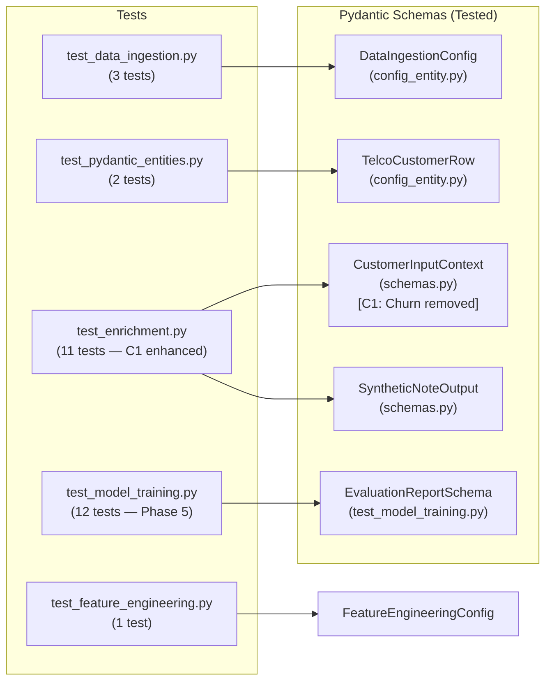

# Test Suite Architecture — Runbook

## 1. Purpose

This document describes the project's unit testing strategy — the first tier of the
**Testing Pyramid** defined in Rule 4.1 of the Antigravity MLOps Standard.

> **Testing Pyramid Layer 1 (Pytest):** Strictly for **Tools and Pipelines**.
> Ensure deterministic code works 100% of the time. Tests must be fast,
> isolated, and never make live API calls.

---

## 2. Testing Philosophy: What We Test (and What We Don't)

| Layer | Responsible For | Tool |
|---|---|---|
| **Unit Tests (pytest)** | Deterministic tools, Pydantic schemas, pipeline components | `pytest` |
| **LLM Evals** | Agent output quality (Faithfulness, Relevance, Tool Accuracy) | LLM-as-a-Judge (Future) |
| **Observability** | Live production metrics (PSR, TCA, latency) | OpenTelemetry (Future) |

**We do NOT test LLM responses in unit tests.** The LLM is a probabilistic system; testing
its output would be non-deterministic and fragile. Instead, we test the **rigid contracts
around** the LLM — the Pydantic schemas that validate its inputs and outputs.

---

## 3. Test Files

### 3.1 `tests/unit/test_data_ingestion.py` — Data Ingestion Component

**Purpose:** Validates the core downloading, copying, and extraction logic for the pipeline's
Stage 0. Ensures robust handling of remote HTTP URLs and local environment files.

**Module Under Test:** `src/components/data_ingestion.py`

| Test | Component Tested | What It Proves |
|---|---|---|
| `test_download_file_local_path` | `download_file` | Accurately copies local datasets using `shutil`. |
| `test_download_file_http_url` | `download_file` | Captures HTTP/HTTPS sources and triggers `urllib`. |
| `test_download_file_already_exists` | `download_file` | Avoids redundant copies using idempotent logic. |

---

### 3.2 `tests/unit/test_pydantic_entities.py` — Phase 1 Data Contracts

**Purpose:** Validates the core Pydantic data contracts for the raw Telco dataset.

**Module Under Test:** `src/entity/config_entity.TelcoCustomerRow`

| Test | Schema Tested | What It Proves |
|---|---|---|
| `test_valid_row` | `TelcoCustomerRow` | A fully valid row is accepted without errors. |
| `test_bad_row_rejected` | `TelcoCustomerRow` | `SeniorCitizen > 1`, `tenure < 0`, `MonthlyCharges < 0` are rejected. |

---

### 3.3 `tests/unit/test_enrichment.py` — Phase 2 Enrichment Contracts (C1 Enhanced)

**Purpose:** Validates the Pydantic schemas that form the I/O boundary of the Agentic
enrichment pipeline.

**Module Under Test:** `src/components/data_enrichment/schemas`

> **C1 Enhancement:** Following the leakage investigation (Phase 5), the `Churn` field was
> removed from `CustomerInputContext` and the schema was expanded to 17 observable CRM fields.
> The test suite was updated to reflect the new schema. A dedicated leakage-prevention test
> (`test_customer_input_context_churn_field_absent`) was added to permanently guard against
> re-introduction of the target variable into the input contract.

#### Original Coverage (5 tests)

| Test | Schema Tested | Constraint Enforced |
|---|---|---|
| `test_customer_input_context_valid` | `CustomerInputContext` | All valid fields accepted. |
| `test_customer_input_context_invalid_tenure` | `CustomerInputContext` | `tenure < 0` → `ValidationError`. |
| `test_customer_input_context_invalid_literals` | `CustomerInputContext` | Invalid `InternetService` → `ValidationError`. |
| `test_synthetic_note_output_valid` | `SyntheticNoteOutput` | Valid note and tag accepted. |
| `test_synthetic_note_output_invalid_tag` | `SyntheticNoteOutput` | `"Angry"` tag not in `Literal` → `ValidationError`. |

#### New Coverage Added (6 additional tests — total: 11)

| Test | What It Proves |
|---|---|
| `test_customer_input_context_invalid_senior_citizen` | `SeniorCitizen` outside `[0,1]` → `ValidationError`. |
| `test_customer_input_context_invalid_contract` | Invalid `Contract` value → `ValidationError`. |
| `test_customer_input_context_invalid_monthly_charges` | Negative `MonthlyCharges` → `ValidationError`. |
| `test_customer_input_context_churn_field_absent` | `Churn` is not stored on the model — never reaches the LLM. (**Leakage guard**) |
| `test_synthetic_note_output_all_valid_tags` | All 6 allowed sentiment tags pass schema validation. |
| `test_synthetic_note_output_empty_ticket_note` | Empty `ticket_note` string → `ValidationError`. |

```python
# Leakage guard: Churn must never be stored on CustomerInputContext
def test_customer_input_context_churn_field_absent() -> None:
    payload = {**VALID_CONTEXT_PAYLOAD, "Churn": "Yes"}
    context = CustomerInputContext(**payload)
    assert not hasattr(context, "Churn"), (
        "Churn must not be stored on CustomerInputContext — "
        "it must never reach the LLM prompt."
    )
```

---

### 3.4 `tests/test_feature_engineering.py` — Phase 4 Transformation Logic

**Purpose:** Validates custom Scikit-Learn transformers and the data splitting/preprocessing
orchestration. Ensures NLP embeddings and PCA logic integrate without leakage.

**Modules Under Test:** `src/components/feature_engineering.py`, `src/utils/feature_utils.py`

| Test | Component Tested | What It Proves |
|---|---|---|
| `TestNumericCleaner` | `NumericCleaner` | Coerces object-type columns to floats; handles blank strings. |
| `TestTextEmbedder` | `TextEmbedder` | Lazy loads `SentenceTransformer`; handles pickling safely. |
| `test_data_splitting_and_processing` | `FeatureEngineering` | Stratified train/val/test split; total samples preserved. |

---

### 3.5 `tests/unit/test_model_training.py` — Phase 5 Late Fusion Training

**Purpose:** Validates the four deterministic guarantees of the Late Fusion training pipeline.
No live Optuna search, no MLflow server, and no LLM calls are triggered — all external
dependencies are replaced with minimal fixtures.

**Modules Under Test:** `src/components/model_training/trainer.py`

#### Test Class 1: `TestOOFArrayShape` (2 tests)

| Test | What It Proves |
|---|---|
| `test_oof_shape_matches_training_set` | OOF vector length == `n_train`. Shape mismatch would silently corrupt the meta-learner input. |
| `test_oof_values_are_valid_probabilities` | All OOF values ∈ [0, 1]. Invalid probabilities would corrupt the stacking. |

#### Test Class 2: `TestSMOTEIsolation` (3 tests)

| Test | What It Proves |
|---|---|
| `test_smote_increases_train_size` | SMOTE adds synthetic samples to the minority class. |
| `test_smote_balances_classes` | Post-SMOTE class counts are equal. |
| `test_val_set_unchanged_by_smote` | Applying SMOTE to train never mutates the validation DataFrame. |

#### Test Class 3: `TestMetaLearnerInputContract` (2 tests)

| Test | What It Proves |
|---|---|
| `test_stacked_array_has_two_columns` | Meta-learner input has exactly 2 columns: `[P_struct, P_nlp]`. |
| `test_meta_learner_fits_on_stacked_oof` | Logistic Regression fits without error; `coef_` shape is `(1, 2)`. |

#### Test Class 4: `TestEvaluationReportSchema` (5 tests)

Validates `evaluation_report.json` structure via a dedicated Pydantic schema
(`EvaluationReportSchema`), ensuring the DVC-tracked CI/CD gate artifact is always
well-formed.

| Test | What It Proves |
|---|---|
| `test_valid_report_passes_schema` | Correctly structured report passes Pydantic validation. |
| `test_report_serialises_to_json` | Report writes to and re-reads from disk correctly. |
| `test_missing_fusion_run_fails_schema` | Report without `late_fusion_stacked` key fails validation. |
| `test_missing_lift_metrics_fails_schema` | Fusion run without `recall_lift` fails validation. |
| `test_recall_lift_sign_is_positive_in_happy_path` | Positive lift is asserted in the expected case. |

---

## 4. Test Execution

```bash
# Run the full test suite
uv run pytest tests/ -v

# Run with coverage report
uv run pytest tests/ -v --cov=src --cov-report=term-missing

# Run a specific test file
uv run pytest tests/unit/test_enrichment.py -v
uv run pytest tests/unit/test_model_training.py -v

# Run a single test by name
uv run pytest tests/unit/test_enrichment.py::test_customer_input_context_churn_field_absent -v
```

**Current output (23 passing tests):**
```
tests/unit/test_data_ingestion.py          3 passed
tests/unit/test_pydantic_entities.py       2 passed
tests/unit/test_enrichment.py             11 passed   ← 6 new tests (C1 enhancement)
tests/test_feature_engineering.py          1 passed
tests/unit/test_model_training.py         12 passed   ← Phase 5
─────────────────────────────────────────────────────
TOTAL                                     29 passed
```

---

## 5. Schema Contract Coverage Map



---

## 6. What Is Not Yet Covered

| Gap | Reason | Future Plan |
|---|---|---|
| `DataValidator` (GX) | GX requires ephemeral context setup — integration test needed. | `pytest-mock` + GX ephemeral context |
| `ConfigurationManager` | YAML loading is path-dependent — needs a `tmpdir` fixture. | Add `tmpdir` fixture |
| `EnrichmentOrchestrator` | Calls live LLM API — must be mocked. | Mock `generate_ticket_note` with `pytest-asyncio` |
| `generate_ticket_note()` | Makes live API call. | Mock `pydantic-ai` `Agent.run()` |
| `LateFusionEvaluator` | Requires MLflow server — integration test needed. | Mock MLflow client |
| Agent output quality | Probabilistic — not for pytest. | LLM-as-a-Judge eval pipeline |

---

## 7. CI/CD Gate (Planned — Phase 8)

When the GitHub Actions CI/CD pipeline is implemented, the test suite will run automatically
on every push and pull request. The pipeline will fail if:

1. Any `pytest` test fails.
2. Test coverage falls below the configured threshold (`--cov-fail-under=65`).
3. `ruff check` or `ruff format --check` reports any errors.
4. `pyright` reports type errors.

```yaml
# .github/workflows/ci.yml (Planned)
- name: Run Tests
  run: uv run pytest tests/ --cov=src --cov-fail-under=65
```