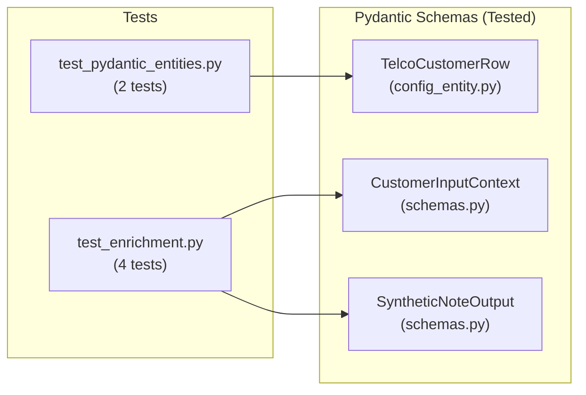

# Test Suite Architecture — Runbook

## 1. Purpose

This document describes the project's unit testing strategy — the first tier of the
**Testing Pyramid** defined in Rule 4.1 of the Antigravity MLOps Standard.

> **Testing Pyramid Layer 1 (Pytest):** Strictly for **Tools and Pipelines**.
> Ensure deterministic code works 100% of the time. Tests must be fast,
> isolated, and never make live API calls.

---

## 2. Testing Philosophy: What We Test (and What We Don't)

| Layer | Responsible For | Tool |
|---|---|---|
| **Unit Tests (pytest)** | Deterministic tools, Pydantic schemas, pipeline components | `pytest` |
| **LLM Evals** | Agent output quality (Faithfulness, Relevance, Tool Accuracy) | LLM-as-a-Judge (Future) |
| **Observability** | Live production metrics (PSR, TCA, latency) | OpenTelemetry (Future) |

**We do NOT test LLM responses in unit tests.** The LLM is a probabilistic system; testing
its output would be non-deterministic and fragile. Instead, we test the **rigid contracts
around** the LLM — the Pydantic schemas that validate its inputs and outputs.

---

## 3. Test Files

### 3.1 `tests/test_pydantic_entities.py` — Phase 1 Data Contracts

**Purpose:** Validates the core Pydantic data contracts for the raw Telco dataset.

**Module Under Test:** `src/entity/config_entity.TelcoCustomerRow`

| Test | Schema Tested | What It Proves |
|---|---|---|
| `test_valid_row` | `TelcoCustomerRow` | A fully valid row is accepted without errors |
| `test_bad_row_rejected` | `TelcoCustomerRow` | `SeniorCitizen > 1`, `tenure < 0`, and `MonthlyCharges < 0` are rejected |

```python
# Example: Verifying the data contract blocks invalid data
def test_bad_row_rejected():
    with pytest.raises(ValidationError):
        TelcoCustomerRow(
            SeniorCitizen=5,   # Invalid: ge=0, le=1
            tenure=-1,         # Invalid: ge=0
            MonthlyCharges=-10 # Invalid: ge=0
        )
```

---

### 3.2 `tests/test_enrichment.py` — Phase 2 Enrichment Contracts

**Purpose:** Validates the Pydantic schemas that form the I/O boundary of the Agentic
enrichment pipeline.

**Module Under Test:** `src/components/data_enrichment/schemas`

#### Test Coverage

| Test | Schema Tested | Constraint Enforced |
|---|---|---|
| `test_customer_input_context_valid` | `CustomerInputContext` | All valid fields accepted |
| `test_customer_input_context_invalid_tenure` | `CustomerInputContext` | `tenure < 0` → `ValidationError` |
| `test_customer_input_context_invalid_literals` | `CustomerInputContext` | Invalid `InternetService` / `Churn` → `ValidationError` |
| `test_synthetic_note_output_valid` | `SyntheticNoteOutput` | Valid note and tag accepted |
| `test_synthetic_note_output_invalid_tag` | `SyntheticNoteOutput` | `"Angry"` tag not in `Literal` → `ValidationError` |

```python
# Example: Verifying the LLM output contract rejects invalid sentiment tags
def test_synthetic_note_output_invalid_tag():
    with pytest.raises(ValidationError):
        SyntheticNoteOutput(
            ticket_note="Customer called experiencing outage.",
            primary_sentiment_tag="Angry",  # Not in Literal[Frustrated, Neutral, ...]
        )
```

---

## 4. Test Execution

```bash
# Run the full test suite
uv run pytest tests/ -v

# Run with coverage report
uv run pytest tests/ -v --cov=src --cov-report=term-missing

# Run a specific test file
uv run pytest tests/test_enrichment.py -v

# Run a single test by name
uv run pytest tests/test_enrichment.py::test_synthetic_note_output_invalid_tag -v
```

---

## 5. Schema Contract Coverage Map



---

## 6. What Is Not Yet Covered

The following areas are intentionally left for future evaluation phases:

| Gap | Reason | Future Plan |
|---|---|---|
| `DataValidator` (GX) | GX requires filesystem or ephemeral context setup — integration test needed | `pytest-mock` + GX ephemeral context |
| `ConfigurationManager` | YAML loading is path-dependent — needs a fixture | Add tmpdir fixture |
| `EnrichmentOrchestrator` | Calls live LLM API — must be mocked | Mock `generate_ticket_note` with `pytest-asyncio` |
| `generate_ticket_note()` | Makes live API call | Mock the `pydantic-ai` `Agent.run()` with asynctest |
| Agent output quality | Probabilistic — not for pytest | LLM-as-a-Judge eval pipeline (Skill: `evals-llm-judge`) |

---

## 7. CI/CD Gate (Planned)

When the GitHub Actions CI/CD pipeline is implemented (Phase 8), the test suite will run
automatically on every push. The pipeline will fail if:

1. Any `pytest` test fails.
2. Test coverage falls below the configured threshold (e.g., 80%).
3. `ruff` linting reports any errors.

```yaml
# .github/workflows/ci.yml (Planned)
- name: Run Tests
  run: uv run pytest tests/ --cov=src --cov-fail-under=80
```
